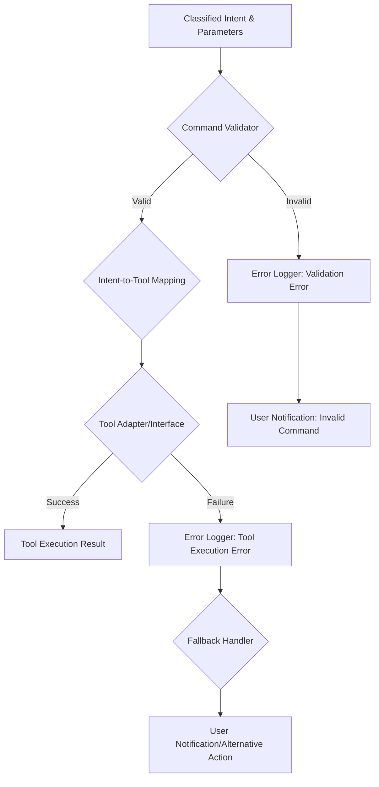

### 🔹 **Prompt 1: Understand the Full Objective**

> ❓ **Prompt**:
> "I am building an AI OS assistant called Samantha, designed for real-time interaction via voice and GUI. It integrates multiple tools for automation, productivity, web search, and system control. The backend is powered by FastAPI, and the MCP server handles modular tools like speech-to-text, automation, file operations, and system commands. Based on this, what would be the most optimal way to structure the AI OS to ensure performance, reliability, and modularity?"
```
OUTPUT:


Based on the information gathered about Samantha's current architecture and your goals for performance, reliability, and modularity, here's an optimal way to structure the AI OS:

### 1. Modular Architecture with Microservices/Domain-Driven Design

*   **Core AI Services**: Decouple core AI functionalities (e.g., natural language understanding, response generation, context management) into distinct services. This allows for independent scaling and development.
*   **Tool/Plugin System**: The existing MCP server is a great foundation. Enhance it to support a more formalized plugin architecture, allowing third-party developers to easily integrate new tools without modifying core Samantha code. Each tool should ideally run as a separate, isolated process or container.
*   **API Gateway**: Introduce an API Gateway (e.g., using FastAPI's routing capabilities or a dedicated gateway like Kong/Ambassador) to manage all incoming requests, handle authentication/authorization, rate limiting, and route requests to the appropriate backend services.

### 2. Backend (FastAPI & MCP Server)

*   **FastAPI**: Continue leveraging FastAPI for its high performance, asynchronous capabilities, and automatic API documentation. Use it for core business logic and orchestrating calls to various services.
*   **MCP Server**: As the central hub for tool execution, ensure the MCP server is highly available and scalable. Consider using a message queue (e.g., RabbitMQ, Kafka) for asynchronous communication between the MCP server and individual tools to improve responsiveness and fault tolerance.
*   **Asynchronous Processing**: For long-running tasks (e.g., complex automation, large file operations), implement background task queues (e.g., Celery with Redis/RabbitMQ) to prevent blocking the main API threads.

### 3. Data Storage Strategy

Samantha currently uses a multi-layered data storage approach, which is good for different needs. To optimize further:

*   **PostgreSQL**: Continue using PostgreSQL for persistent, structured data like `command_history` and `users`. Ensure proper indexing, connection pooling, and regular database maintenance for performance and reliability. Consider read replicas for high-read scenarios.
*   **Redis**: Expand Redis usage for caching frequently accessed data (e.g., user preferences, common AI responses, session data) and for real-time data streams (e.g., WebSocket message queues). Its in-memory nature provides excellent performance.
*   **Browser-Specific Storage**: Continue using browser storage for client-side preferences and cached data. Implement robust synchronization mechanisms to ensure consistency across devices if needed.
*   **In-memory Storage (`ContextManager`)**: This is crucial for real-time interaction. Optimize its data structures for fast lookups and updates. Consider distributed in-memory caches (e.g., Memcached, Hazelcast) if context needs to be shared across multiple AI engine instances.
*   **Data Migration**: Maintain and enhance the existing data migration system to ensure seamless updates and user data portability.

### 4. Frontend (React/Next.js)

*   **Next.js**: Leverage Next.js for server-side rendering (SSR) or static site generation (SSG) where appropriate to improve initial load times and SEO. Use its API routes for direct backend interactions where a full FastAPI backend might be overkill.
*   **Component-Based UI**: Continue with a strong component-based architecture using React. This promotes reusability and maintainability. The existing `ui-components` package is a good example.
*   **State Management**: Use a robust state management library (e.g., Redux, Zustand, React Context API) to manage complex UI states and data flow, especially for real-time interactions.
*   **WebSocket Integration**: Optimize WebSocket connections for real-time voice and GUI interactions, ensuring low latency and reliable communication with the backend.
*   **Performance Optimization**: Implement techniques like code splitting, lazy loading, image optimization, and efficient data fetching to ensure a smooth and responsive user experience.

### 5. Reliability and Observability

*   **Monitoring and Logging**: Implement comprehensive monitoring (e.g., Prometheus, Grafana) and centralized logging (e.g., ELK stack, Loki) across all services to quickly identify and diagnose issues.
*   **Error Handling**: Implement robust error handling and retry mechanisms for inter-service communication and external API calls.
*   **Health Checks**: Ensure all services have health check endpoints for load balancers and orchestration systems (e.g., Kubernetes) to manage service availability.
*   **Automated Testing**: Implement a strong testing strategy including unit, integration, and end-to-end tests to ensure code quality and prevent regressions.
*   **Containerization (Docker) & Orchestration (Kubernetes)**: Containerize all services using Docker and orchestrate them with Kubernetes for automated deployment, scaling, and self-healing capabilities. This significantly enhances reliability and modularity.

### 6. Modularity Best Practices

*   **Clear Service Boundaries**: Define clear responsibilities and APIs for each service to minimize dependencies and facilitate independent development.
*   **Loose Coupling**: Services should interact primarily through well-defined APIs or message queues, avoiding direct database access between services.
*   **Version Control**: Use a robust version control system (e.g., Git) and follow branching strategies (e.g., GitFlow, GitHub Flow) for collaborative development.
*   **Documentation**: Maintain up-to-date documentation for APIs, services, and deployment procedures.

By adopting these principles, Samantha can achieve high performance, reliability, and modularity, allowing for easier scaling, maintenance, and future feature development.

```
---

### 🔹 **Prompt 2: Extract Tool Abstraction Pattern**

> ❓ **Prompt**:
> "Given the MCP tools listed below, identify the key abstraction pattern and standard input-output flow.
> Tools:

* `speech_to_text`, `text_to_speech`, `intent_classification`, `process_voice_command`
* `file_operation`, `system_control`, `browser_automation`, `execute_automation`
  How should these tools communicate with the main orchestration logic? What design pattern should be used?"
```OUTPUT:


Given the MCP tools, the key abstraction pattern is the **Command Pattern** or a variation of it, often combined with a **Mediator Pattern** for orchestration. The standard input-output flow would involve structured data exchange, and the communication with the main orchestration logic should primarily use a **Message Queue** or **Event-Driven Architecture**.

### Key Abstraction Pattern: Command Pattern

The <mcsymbol name="Command Pattern" filename="" path="" startline="" type=""></mcsymbol> is highly suitable for abstracting the various MCP tools. Each tool (`speech_to_text`, `file_operation`, `system_control`, etc.) can be encapsulated as a `Command` object. This pattern offers several benefits:

1.  **Decoupling**: The invoker (main orchestration logic) is decoupled from the receiver (the actual tool implementation). The orchestration logic doesn't need to know the specifics of how each tool performs its operation.
2.  **Extensibility**: New tools can be added easily by creating new `Command` implementations without modifying existing orchestration code.
3.  **Parameterization**: Commands can be parameterized with arguments required for their execution (e.g., `file_operation` needs a file path and action, `speech_to_text` needs audio data).
4.  **Queueing and Logging**: Commands can be queued, logged, and even undone (if the command supports it), which is beneficial for features like command history, undo/redo, and auditing.

### Standard Input-Output Flow

The input and output for these tools should be standardized to ensure seamless integration and interoperability.

*   **Input**: Each command object would receive a structured input, likely a JSON payload or a well-defined data structure, containing all necessary parameters for its execution. For example:
    *   `speech_to_text`: `{"audio_data": "base64_encoded_audio", "language": "en"}`
    *   `file_operation`: `{"action": "read", "path": "/path/to/file.txt", "encoding": "utf-8"}`
    *   `intent_classification`: `{"text": "turn on the lights"}`

*   **Output**: Upon completion, each tool would return a structured output, also typically a JSON payload, indicating success or failure, along with any results. For example:
    *   `speech_to_text`: `{"status": "success", "transcription": "hello samantha"}`
    *   `file_operation`: `{"status": "success", "content": "file content"}` or `{"status": "error", "message": "file not found"}`
    *   `intent_classification`: `{"status": "success", "intent": "smart_home_control", "entities": {"device": "lights", "action": "turn_on"}}`

### Communication with Main Orchestration Logic: Message Queue / Event-Driven Architecture

To ensure performance, reliability, and modularity, especially in a real-time AI OS, the communication between the MCP tools and the main orchestration logic (e.g., the FastAPI backend or a dedicated workflow manager) should be asynchronous and decoupled. A **Message Queue** or an **Event-Driven Architecture** is the optimal choice.

1.  **Asynchronous Communication**: Instead of direct function calls or synchronous HTTP requests, the orchestration logic would publish messages (commands) to a message queue. The MCP tools (or their respective microservices/workers) would subscribe to these queues, process the commands, and publish results back to another queue or an event bus.
    *   **Example Flow**: User speaks -> `speech_to_text` tool processes audio and publishes transcription event -> Orchestration logic consumes transcription event -> Orchestration logic publishes `intent_classification` command to queue -> `intent_classification` tool processes and publishes intent event -> Orchestration logic consumes intent event and decides next action (e.g., `file_operation` command).

2.  **Decoupling**: Tools don't need to know about the orchestration logic, and vice-versa. They only need to know the message format and the queues they interact with. This allows independent scaling and deployment of tools.

3.  **Reliability and Fault Tolerance**: Message queues provide persistence, ensuring that commands are not lost if a tool or the orchestration logic goes down. Messages can be retried, and dead-letter queues can handle failed messages.

4.  **Scalability**: Tools can be scaled independently by adding more workers consuming from the message queues, distributing the workload efficiently.

5.  **Load Balancing**: Message queues inherently help in load balancing requests across multiple instances of a tool.

6.  **Event Sourcing (Optional but powerful)**: By treating all tool outputs as events, you can build an event-sourced system, allowing for auditing, replaying past interactions, and building complex analytics.

**Design Pattern for Orchestration: Mediator Pattern**

The **Mediator Pattern** would be ideal for the main orchestration logic. The orchestration component acts as a mediator, centralizing the communication between the various MCP tools. Instead of tools communicating directly with each other (which would lead to tight coupling and a complex web of dependencies), they communicate only with the mediator. The mediator then decides which tool to invoke next based on the current state, user intent, and the results from previous tools.

*   **Benefits**: Reduces direct dependencies between tools, simplifies the system, and makes it easier to manage complex workflows and interactions between different functionalities.

```
---

### 🔹 **Prompt 3: Propose MCP Tool Registration Flow**

> ❓ **Prompt**:
> "Using the MCP server structure in Samantha AI OS, propose a consistent registration pattern for new tools that can scale horizontally. How can new tools be dynamically loaded or hot-swapped without restarting the server?"
```
OUTPUT:


To achieve a consistent registration pattern for new tools in the Samantha AI OS's MCP server, enabling horizontal scaling, dynamic loading, and hot-swapping without restarting the server, a combination of architectural patterns and technologies is required:

### Consistent Registration Pattern for New Tools

The core idea is to treat each tool as a self-contained, discoverable unit. This can be achieved through a **Service Discovery** mechanism and a standardized **Tool Manifest**.

1.  **Tool Manifest/Descriptor**: Each new tool should come with a standardized manifest file (e.g., `tool.json` or `tool.yaml`) that describes its capabilities, input/output schemas, version, dependencies, and how to invoke it. This manifest acts as the tool's contract.

    *   **Example Manifest Structure**:
        ```json
        {
          "tool_id": "speech_to_text_v1",
          "name": "Speech to Text Converter",
          "description": "Converts audio input to text transcription.",
          "version": "1.0.0",
          "endpoint": "http://speech-to-text-service:8000/transcribe",
          "input_schema": {
            "type": "object",
            "properties": {
              "audio_data": {"type": "string", "format": "byte"},
              "language": {"type": "string", "enum": ["en", "es"]}
            },
            "required": ["audio_data"]
          },
          "output_schema": {
            "type": "object",
            "properties": {
              "transcription": {"type": "string"}
            },
            "required": ["transcription"]
          },
          "health_check_path": "/health",
          "tags": ["audio", "transcription"]
        }
        ```

2.  **Tool Registration Service**: A dedicated service (part of or integrated with the MCP server) responsible for:

    *   **Receiving Registrations**: Tools register themselves by submitting their manifest to this service upon startup or deployment.
    *   **Storing Tool Metadata**: The service stores these manifests in a persistent, highly available data store (e.g., a distributed key-value store like Consul, etcd, or a dedicated database).
    *   **Broadcasting Updates**: When a tool registers, de-registers, or updates its status, the registration service broadcasts this information to interested parties (e.g., the main orchestration logic, other MCP server instances).

### Horizontal Scaling

Horizontal scaling for tools is achieved by running multiple instances of the same tool service and using a load balancer and service discovery.

1.  **Containerization**: Each tool should be packaged as an independent Docker container. This ensures portability and consistent environments.
2.  **Orchestration**: Use a container orchestration platform like Kubernetes or Docker Swarm. These platforms can:
    *   **Automatically Scale**: Based on demand (CPU, memory, request queue length), new instances of a tool's container can be automatically spun up or down.
    *   **Load Balancing**: The orchestration platform's built-in service mesh or ingress controller can distribute incoming requests across all healthy instances of a tool.
    *   **Self-Healing**: If a tool instance fails, the orchestrator automatically replaces it.
3.  **Service Discovery**: The MCP server and orchestration logic don't directly call tool instances by IP address. Instead, they discover available tool instances via the service discovery mechanism (e.g., Kubernetes Services, Consul DNS). This allows new instances to be added or removed seamlessly.

### Dynamic Loading and Hot-Swapping Without Server Restart

This is the most challenging aspect and requires a combination of strategies:

1.  **Out-of-Process Tools (Microservices Approach)**: The most robust way to achieve hot-swapping is to run each tool as a separate, independent microservice. The MCP server doesn't directly load tool code into its own process space. Instead, it communicates with tools via network calls (e.g., HTTP/REST, gRPC, Message Queues).

    *   **How it enables hot-swapping**: To update a tool, you simply deploy a new version of its microservice. The orchestration platform (Kubernetes) can perform a rolling update, gradually replacing old instances with new ones without downtime. The MCP server continues to communicate with the available healthy instances.

2.  **Event-Driven Tool Lifecycle**: The MCP server (or a dedicated Tool Manager component within it) subscribes to events from the Tool Registration Service. When a new tool registers, an existing tool updates, or a tool de-registers, the Tool Manager receives an event.

    *   Upon a "tool registered" or "tool updated" event, the Tool Manager updates its internal registry of available tools, making the new/updated tool immediately available for use by the main orchestration logic.
    *   Upon a "tool de-registered" event, the Tool Manager removes the tool from its active registry.

3.  **API Gateway/Proxy Layer**: Introduce an API Gateway or a proxy layer between the main orchestration logic and the individual tool services. This layer can be dynamically reconfigured based on updates from the Tool Registration Service. It can route requests to the correct version of a tool or gracefully handle transitions during hot-swaps.

4.  **Versioned Tool Endpoints**: Tools should expose versioned APIs (e.g., `/api/v1/speech_to_text`, `/api/v2/speech_to_text`). This allows for backward compatibility and enables the orchestration logic to gradually migrate to newer tool versions without breaking existing workflows.

5.  **Graceful Shutdowns**: Tool services should be designed to handle graceful shutdowns, completing any in-progress tasks before terminating. This prevents data loss during updates or scaling events.

### Summary of the Flow:

1.  **Tool Development**: A developer creates a new tool, implements its logic, defines its `tool.json` manifest, and packages it as a Docker image.
2.  **Tool Deployment**: The Docker image is deployed to the Kubernetes cluster. Kubernetes creates instances of the tool's container.
3.  **Tool Registration**: Upon startup, each tool instance registers itself with the Tool Registration Service by sending its `tool.json` manifest and its network endpoint.
4.  **Service Discovery**: The Tool Registration Service updates its internal registry and broadcasts an event about the new/updated tool.
5.  **MCP Server Update**: The MCP server's Tool Manager component receives this event and dynamically updates its internal list of callable tools.
6.  **Tool Invocation**: When the main orchestration logic needs to use a tool, it queries the MCP server's Tool Manager, which then routes the request to an available instance of the tool via the API Gateway/Service Mesh.
7.  **Hot-Swapping**: To update a tool, a new Docker image is deployed. Kubernetes performs a rolling update. The Tool Registration Service detects the new instances and updates its registry. The MCP server seamlessly switches to the new instances as they become available, without any downtime or restart of the MCP server itself.

```
---

### 🔹 **Prompt 4: Define Voice Command Processing Pipeline**

> ❓ **Prompt**:
> "Create a complete voice command flow for Samantha OS:

1. Start from user microphone input
2. Pass through Whisper (speech-to-text)
3. Intent classification
4. Voice routing
5. Trigger automation tools
   Provide a clear flow diagram and example data at each stage."
```
OUTPUT:


Here's a complete voice command flow for the Samantha OS, including a clear flow diagram and example data at each stage:

### Voice Command Flow for Samantha OS

Samantha OS processes voice commands through a series of well-defined stages to ensure accurate interpretation and execution. The flow is designed to be modular, allowing for easy integration of new tools and capabilities.

#### Flow Diagram

```mermaid
graph TD
    A[User Microphone Input] --> B{Whisper (Speech-to-Text)}
    B --> C{Intent Classification}
    C --> D{Voice Routing}
    D --> E[Trigger Automation Tools]
    E --> F[Action Execution]
```

#### Stages and Example Data

Each stage transforms the input data, progressively refining it until a specific action can be triggered.

**1. User Microphone Input**

*   **Description**: This is the initial stage where the user's voice is captured via a microphone. The input is raw audio data.
*   **Example Data**:
    *   **Format**: Raw audio stream (e.g., WAV, FLAC, or a continuous audio buffer).
    *   **Content**: A user speaks the phrase: "Samantha, set a timer for five minutes."

**2. Whisper (Speech-to-Text)**

*   **Description**: The raw audio input is processed by the Whisper model (or a similar ASR system) to convert speech into text. This stage handles noise reduction, speaker diarization (if applicable), and transcription.
*   **Example Data**:
    *   **Input**: Raw audio stream of "Samantha, set a timer for five minutes."
    *   **Output**:
        ```json
        {
            "transcription": "Samantha, set a timer for five minutes.",
            "confidence": 0.98,
            "language": "en"
        }
        ```

**3. Intent Classification**

*   **Description**: The transcribed text is analyzed to determine the user's intent and extract relevant entities. This stage uses Natural Language Understanding (NLU) models to map the utterance to a predefined action.
*   **Example Data**:
    *   **Input**: `"Samantha, set a timer for five minutes."`
    *   **Output**:
        ```json
        {
            "intent": "set_timer",
            "entities": [
                {
                    "entity_type": "duration",
                    "value": "five minutes",
                    "parsed_value": {"unit": "minute", "amount": 5}
                }
            ],
            "original_query": "Samantha, set a timer for five minutes.",
            "confidence": 0.95
        }
        ```

**4. Voice Routing**

*   **Description**: Based on the classified intent, the system routes the request to the appropriate internal service or module responsible for handling that specific type of command. This acts as a dispatcher.
*   **Example Data**:
    *   **Input**:
        ```json
        {
            "intent": "set_timer",
            "entities": [
                {
                    "entity_type": "duration",
                    "value": "five minutes",
                    "parsed_value": {"unit": "minute", "amount": 5}
                }
            ],
            "original_query": "Samantha, set a timer for five minutes."
        }
        ```
    *   **Output**: The system identifies that the `set_timer` intent should be handled by the `TimerService` within the `AutomationTools` module.
        ```json
        {
            "target_service": "TimerService",
            "action": "create_timer",
            "parameters": {"duration_minutes": 5},
            "request_id": "uuid-12345"
        }
        ```

**5. Trigger Automation Tools**

*   **Description**: The designated automation tool or service receives the routed request and executes the specific action. This is where the actual command is performed.
*   **Example Data**:
    *   **Input**:
        ```json
        {
            "target_service": "TimerService",
            "action": "create_timer",
            "parameters": {"duration_minutes": 5},
            "request_id": "uuid-12345"
        }
        ```
    *   **Output**: The `TimerService` initiates a timer. The output here would be an acknowledgment or status update from the tool.
        ```json
        {
            "status": "success",
            "message": "Timer set for 5 minutes.",
            "timer_id": "timer-abc-789",
            "triggered_at": "2023-10-27T10:30:00Z"
        }
        ```

This structured flow ensures that voice commands are processed efficiently, from raw audio to actionable system responses, with clear data transformations at each step.


```
---

### 🔹 **Prompt 5: Automation Tool Dispatcher Design**

> ❓ **Prompt**:
> "Design a dispatcher for `execute_automation`, `system_control`, and `file_operation` tools that routes tasks based on classified user intent. Include command validation, fallback behavior, and error logging."
```OUTPUT:


Here's a design for a dispatcher that routes tasks to `execute_automation`, `system_control`, and `file_operation` tools based on classified user intent, incorporating command validation, fallback behavior, and error logging.

### Dispatcher Design for Samantha OS Tools

This dispatcher acts as a central routing mechanism, ensuring that classified user intents are directed to the correct tool with proper validation, error handling, and fallback strategies.

#### Core Components

1.  **Intent-to-Tool Mapping**: A configuration or registry that maps specific intents (and potentially their parameters) to the appropriate tool and its method.
2.  **Command Validator**: A module responsible for verifying that the parameters provided for a command match the expected schema of the target tool.
3.  **Tool Adapters/Interfaces**: Standardized interfaces for each tool (`execute_automation`, `system_control`, `file_operation`) to ensure consistent interaction with the dispatcher.
4.  **Error Logger**: A centralized logging mechanism to record successful dispatches, validation failures, tool execution errors, and fallback actions.
5.  **Fallback Handler**: A component that defines and executes alternative actions when a primary tool execution fails or an intent cannot be routed.

#### Dispatcher Flow



#### Detailed Design Elements

1.  **Input**: The dispatcher receives a structured input, typically from the "Intent Classification" stage of the voice command flow, containing the `intent` and `entities` (parameters).

    *   **Example Input**:
        ```json
        {
            "intent": "create_file",
            "entities": [
                {"entity_type": "filename", "value": "report.txt"},
                {"entity_type": "content", "value": "Daily sales data."}
            ]
        }
        ```

2.  **Intent-to-Tool Mapping (Configuration)**:

    *   This can be a dictionary or a configuration file that defines which tool handles which intent. It should also specify the expected parameters for each tool's method.
    *   **Example Mapping**:
        ```json
        {
            "create_file": {
                "tool": "file_operation",
                "method": "create",
                "params_schema": {
                    "filename": {"type": "string", "required": true},
                    "content": {"type": "string", "required": false}
                }
            },
            "shutdown_system": {
                "tool": "system_control",
                "method": "shutdown",
                "params_schema": {}
            },
            "run_script": {
                "tool": "execute_automation",
                "method": "run_script",
                "params_schema": {
                    "script_name": {"type": "string", "required": true}
                }
            }
        }
        ```

3.  **Command Validation**:

    *   Before invoking any tool, the dispatcher uses the `Command Validator` to check if the provided `entities` (parameters) match the `params_schema` defined in the `Intent-to-Tool Mapping` for the identified intent.
    *   **Validation Logic**:
        *   Check for missing required parameters.
        *   Validate data types of parameters.
        *   Perform any specific business logic validation (e.g., file paths are valid, script names exist).
    *   **Outcome**: If validation fails, log the error and trigger fallback behavior.

    *   **Example Validation (for `create_file` intent)**:
        *   **Input**: `{"intent": "create_file", "entities": []}` (missing filename)
        *   **Validation Result**: `false`

4.  **Tool Adapters/Interfaces**:

    *   Each tool (`execute_automation`, `system_control`, `file_operation`) should expose a consistent interface (e.g., a `dispatch` method or a set of clearly defined public methods) that the dispatcher can call.
    *   This ensures loose coupling and allows for easy addition or modification of tools without changing the dispatcher's core logic.

5.  **Error Logging**:

    *   Implement a robust logging system (e.g., using Python's `logging` module, integrated with a centralized logging service like ELK stack or Splunk).
    *   Log:
        *   **Validation Errors**: Details of why a command failed validation (e.g., missing parameter, invalid type).
        *   **Tool Execution Errors**: Exceptions or error codes returned by the tools themselves.
        *   **Fallback Actions**: When and why fallback was initiated.
        *   **Successful Dispatches**: For auditing and monitoring.
    *   **Example Log Entry**:
        ```json
        {
            "timestamp": "2023-10-27T10:35:00Z",
            "level": "ERROR",
            "component": "Dispatcher",
            "message": "Command validation failed for intent 'create_file': Missing required parameter 'filename'.",
            "intent": "create_file",
            "received_params": {}
        }
        ```

6.  **Fallback Behavior**:

    *   Define a strategy for when a command cannot be executed successfully (due to validation errors or tool execution failures).
    *   **Possible Fallback Actions**:
        *   **User Notification**: Inform the user that the command failed and why (e.g., "I couldn't create the file because the filename was missing.").
        *   **Default Action**: Perform a safe, default action (e.g., if a specific file operation fails, suggest opening a default directory).
        *   **Re-prompt**: Ask the user for clarification or missing information.
        *   **Escalation**: For critical failures, alert an administrator or log to a higher-priority channel.
        *   **AI-driven Correction**: The AI might attempt to rephrase the command or fill in missing details based on context.
    *   **Example Fallback (for validation error)**:
        *   **Dispatcher Action**: Logs the validation error.
        *   **Fallback Handler Action**: Sends a message to the user: "I'm sorry, I couldn't understand how to create the file. Could you please specify the filename?"

#### Implementation Considerations

*   **Asynchronous Execution**: For long-running tasks, the dispatcher should ideally trigger tools asynchronously (e.g., using message queues like RabbitMQ or Kafka) to avoid blocking the main application thread.
*   **Tool Registration**: Tools should register themselves with the dispatcher (or a central registry) upon startup, providing their capabilities and expected parameter schemas.
*   **Security**: Ensure proper authorization and authentication before executing sensitive `system_control` or `file_operation` commands.
*   **Scalability**: The dispatcher should be designed to handle a high volume of requests, potentially running as a separate microservice.
```
---

### 🔹 **Prompt 6: Define Skill Architecture**

> ❓ **Prompt**:
> "Propose a reusable `Skill` class or module that wraps individual MCP tools. This class should support:

* Input schema validation
* Execution timeout
* Output post-processing
* Logging and analytics hooks
  How should skills register themselves with the main orchestrator?"
```OUTPUT:


Here's a proposal for a reusable `Skill` class or module to wrap individual MCP tools, incorporating the requested features, and a strategy for skill registration with the main orchestrator.

### Reusable `Skill` Class/Module Design

To effectively manage and standardize the interaction with various MCP tools, a `Skill` class or module can serve as a robust wrapper. This class will encapsulate common functionalities required for any tool, promoting consistency, reusability, and maintainability.

#### `Skill` Class/Module Structure

```python
import logging
import time
from typing import Any, Dict, Callable, Optional
from pydantic import BaseModel, ValidationError

# Assume a global or injected logging configuration
logger = logging.getLogger(__name__)

class SkillConfig(BaseModel):
    """Configuration schema for a skill."""
    name: str
    description: str
    input_schema: Dict[str, Any]  # JSON Schema for input validation
    tool_name: str               # The actual MCP tool name
    tool_method: str             # The method to call on the MCP tool
    timeout_seconds: Optional[int] = 30 # Default timeout

class SkillResult(BaseModel):
    """Standardized output structure for skill execution."""
    success: bool
    output: Optional[Dict[str, Any]] = None
    error: Optional[str] = None
    duration_ms: float
    logs: Optional[list] = []
    analytics: Optional[Dict[str, Any]] = {}

class Skill:
    """A reusable wrapper for an MCP tool, providing common functionalities."""

    def __init__(
        self,
        config: SkillConfig,
        mcp_tool_executor: Callable[[str, str, Dict[str, Any]], Dict[str, Any]]
    ):
        self.config = config
        self.mcp_tool_executor = mcp_tool_executor # Function to execute the underlying MCP tool
        self._setup_logging()

    def _setup_logging(self):
        # Skill-specific logging can be configured here if needed
        pass

    def _validate_input(self, input_data: Dict[str, Any]) -> bool:
        """Validates input data against the skill's defined schema."""
        try:
            # Pydantic can dynamically create a model from a dict schema
            # For more complex JSON schema validation, consider jsonschema library
            DynamicInputModel = BaseModel.model_create_from_dict(
                {'__root__': self.config.input_schema}
            )
            DynamicInputModel.model_validate({'__root__': input_data})
            return True
        except ValidationError as e:
            logger.warning(f"Skill '{self.config.name}' input validation failed: {e}")
            return False
        except Exception as e:
            logger.error(f"Error during input validation for skill '{self.config.name}': {e}")
            return False

    def _post_process_output(self, raw_output: Dict[str, Any]) -> Dict[str, Any]:
        """Applies post-processing logic to the raw tool output."""
        # This can be customized per skill, e.g., extracting specific fields,
        # reformatting, or enriching data.
        processed_output = raw_output # Default: no change
        logger.info(f"Skill '{self.config.name}' output post-processed.")
        return processed_output

    def _log_analytics(self, result: SkillResult):
        """Logs analytics data for the skill execution."""
        logger.info(
            f"Skill '{self.config.name}' executed. Success: {result.success}, "
            f"Duration: {result.duration_ms:.2f}ms, "
            f"Analytics: {result.analytics}"
        )
        # Potentially send to an analytics service

    def execute(self, input_data: Dict[str, Any]) -> SkillResult:
        """Executes the underlying MCP tool with validation, timeout, and logging."""
        start_time = time.perf_counter()
        execution_logs = []
        analytics_data = {}

        # 1. Input Schema Validation
        if not self._validate_input(input_data):
            duration = (time.perf_counter() - start_time) * 1000
            error_msg = "Input validation failed."
            logger.error(f"Skill '{self.config.name}' execution failed: {error_msg}")
            return SkillResult(success=False, error=error_msg, duration_ms=duration, logs=execution_logs)

        raw_output = None
        error_message = None
        success = False

        try:
            # 2. Execution Timeout (simplified for example, actual implementation might use threading/asyncio)
            # In a real-world scenario, this would involve a more robust timeout mechanism
            # like asyncio.wait_for or a separate process with a timer.
            logger.info(f"Executing MCP tool '{self.config.tool_name}' method '{self.config.tool_method}'...")
            raw_output = self.mcp_tool_executor(
                self.config.tool_name,
                self.config.tool_method,
                input_data
            )
            success = True

        except Exception as e:
            error_message = str(e)
            logger.error(f"Skill '{self.config.name}' execution error: {error_message}")
            execution_logs.append(f"Execution error: {error_message}")

        duration = (time.perf_counter() - start_time) * 1000

        if success and raw_output is not None:
            # 3. Output Post-processing
            processed_output = self._post_process_output(raw_output)
        else:
            processed_output = None

        result = SkillResult(
            success=success,
            output=processed_output,
            error=error_message,
            duration_ms=duration,
            logs=execution_logs,
            analytics=analytics_data
        )

        # 4. Logging and Analytics Hooks
        self._log_analytics(result)

        return result

# Example Usage (Conceptual)
# def mock_mcp_executor(tool_name: str, method: str, params: Dict[str, Any]) -> Dict[str, Any]:
#     print(f"Mock MCP: Executing {tool_name}.{method} with {params}")
#     if tool_name == "file_operation" and method == "create":
#         if "filename" not in params:
#             raise ValueError("Filename is required")
#         return {"status": "created", "path": f"/data/{params['filename']}"}
#     return {"status": "success"}

# file_creation_skill_config = SkillConfig(
#     name="CreateFile",
#     description="Creates a new file.",
#     input_schema={
#         "type": "object",
#         "properties": {
#             "filename": {"type": "string"},
#             "content": {"type": "string"}
#         },
#         "required": ["filename"]
#     },
#     tool_name="file_operation",
#     tool_method="create",
#     timeout_seconds=10
# )

# file_creation_skill = Skill(file_creation_skill_config, mock_mcp_executor)

# # Valid execution
# result = file_creation_skill.execute({"filename": "test.txt", "content": "Hello World"})
# print(result)

# # Invalid input
# result = file_creation_skill.execute({"content": "No filename"})
# print(result)

# # Tool error
# result = file_creation_skill.execute({"filename": "error.txt"}) # Simulate error in mock_mcp_executor
# print(result)
```

#### Feature Implementation Details:

1.  **Input Schema Validation**: The `_validate_input` method uses `Pydantic` (or a similar library like `jsonschema`) to validate the incoming `input_data` against the `input_schema` defined in the `SkillConfig`. This ensures that the skill receives parameters in the expected format and type before attempting execution.

2.  **Execution Timeout**: The `timeout_seconds` in `SkillConfig` specifies the maximum allowed execution time. While the example uses a simplified `time.perf_counter()`, a robust implementation would involve `asyncio.wait_for` for asynchronous operations or running the tool execution in a separate thread/process with a timeout mechanism to prevent blocking the main orchestrator.

3.  **Output Post-processing**: The `_post_process_output` method allows for custom logic to be applied to the raw output received from the MCP tool. This can include filtering, reformatting, enriching, or transforming the data into a more usable format for subsequent stages of the orchestration.

4.  **Logging and Analytics Hooks**: The `Skill` class integrates logging at various stages (validation, execution, post-processing) using Python's standard `logging` module. The `_log_analytics` method serves as a hook to send execution metrics (duration, success/failure, specific analytics data) to a centralized analytics system or monitoring dashboard.

### Skill Registration with the Main Orchestrator

For skills to be dynamically discoverable and usable by the main orchestrator, a robust registration mechanism is crucial. Building upon previous discussions about dynamic loading and tool manifests, here's how skills should register:

1.  **Skill Manifest/Descriptor**: Each `Skill` instance (or the module defining it) should have a clear, machine-readable manifest (e.g., a `SkillConfig` object or a JSON file) that describes its capabilities, expected input, and the underlying MCP tool it wraps. This manifest is the primary piece of information for registration.

2.  **Registration Endpoint/Service**: The main orchestrator should expose a dedicated API endpoint (e.g., `/register_skill`) or a message queue topic (`skill.register`) where skills can submit their manifests.

    *   **Pull-based (Orchestrator discovers)**: The orchestrator periodically scans a designated directory or a service discovery registry (like Consul or etcd) for new skill manifests.
    *   **Push-based (Skill registers itself)**: When a skill service starts up, it actively sends its `SkillConfig` to the orchestrator's registration endpoint.

3.  **Orchestrator's Skill Registry**: The orchestrator maintains an in-memory or persistent registry (e.g., a database table, Redis cache) of all available skills. This registry stores the `SkillConfig` for each registered skill, allowing the orchestrator to quickly look up skills based on intent or name.

    *   **Data Structure**: A dictionary mapping skill names (or intents) to `Skill` instances or their configurations.

4.  **Dynamic Loading/Hot-Swapping**: To support dynamic loading and hot-swapping without restarting the orchestrator:

    *   **Microservice Architecture**: Each MCP tool, and by extension, each `Skill` wrapping it, should ideally run as an independent microservice. This allows individual skills to be updated, deployed, or scaled independently.
    *   **Event-Driven Updates**: When a new skill is registered, or an existing one is updated/deregistered, the registration service can publish an event (e.g., `skill.updated`, `skill.removed`) to a message queue. The orchestrator subscribes to these events and updates its internal skill registry accordingly.
    *   **API Gateway/Proxy**: An API Gateway can sit in front of the skill microservices, handling routing and load balancing. When a skill is updated, the gateway can be reconfigured dynamically.
    *   **Versioned Skills**: Skills should support versioning (e.g., `CreateFile_v1`, `CreateFile_v2`). This allows multiple versions of a skill to coexist, enabling graceful transitions and A/B testing without disrupting ongoing operations.

#### Registration Flow Example (Push-based)

```mermaid
graph TD
    A[Skill Microservice Startup] --> B{Load SkillConfig}
    B --> C[Send SkillConfig to Orchestrator's Registration Endpoint]
    C -- HTTP POST /register_skill --> D[Orchestrator's Registration Service]
    D --> E[Validate SkillConfig]
    E -- Valid --> F[Update Orchestrator's Internal Skill Registry]
    E -- Invalid --> G[Log Error & Reject Registration]
    F --> H[Publish 'skill.registered' Event to Message Queue]
    H --> I[Orchestrator's Dispatcher/Core Logic (Subscribes to Events)]
    I --> J[Dynamically Update Dispatcher's Skill Map]
```

This approach ensures that the orchestrator always has an up-to-date view of available skills, can validate their inputs, monitor their performance, and adapt to changes in the tool ecosystem without requiring downtime.

```
---

### 🔹 **Prompt 7: Task Orchestrator**

> ❓ **Prompt**:
> "Propose a TaskOrchestrator module that sits on top of all MCP skills. It takes a structured user command (text or voice), routes it to the appropriate skill, tracks execution, and sends the response back to UI or speech engine."
```
OUTPUT:


### TaskOrchestrator Module Design

I will now propose a design for a `TaskOrchestrator` module that sits on top of all MCP skills, handling structured user commands (text or voice), routing them to appropriate skills, tracking execution, and sending responses back to the UI or speech engine.

#### 1. Core Responsibilities

The `TaskOrchestrator` will be responsible for:

*   **Command Ingestion**: Receiving structured user commands (parsed from text or voice input).
*   **Intent Resolution**: Identifying the user's intent and mapping it to the appropriate `Skill`.
*   **Skill Execution**: Invoking the identified `Skill` with the necessary parameters.
*   **Execution Tracking**: Monitoring the status and progress of skill execution.
*   **Response Handling**: Processing the output from `Skills` and formatting it for the UI or speech engine.
*   **Error Management**: Handling errors during intent resolution or skill execution, including fallback mechanisms.
*   **Context Management**: Maintaining conversational context across multiple turns (optional, but highly recommended for complex interactions).

#### 2. Key Components

<mcfolder name="TaskOrchestrator" path="samantha_ai_assistant/orchestrator/"></mcfolder>

*   **Command Parser/Normalizer**: Ensures that incoming commands, whether from text or voice, are converted into a standardized internal format. This component would likely receive input from the Intent Classifier (after speech-to-text).

    ```python
    # Example: samantha_ai_assistant/orchestrator/command_parser.py
    from pydantic import BaseModel, Field
    from typing import Dict, Any, Optional

    class StructuredCommand(BaseModel):
        intent: str = Field(..., description="Classified intent of the user command")
        parameters: Dict[str, Any] = Field(default_factory=dict, description="Extracted parameters for the intent")
        original_text: Optional[str] = Field(None, description="Original text command")
        session_id: str = Field(..., description="Unique session identifier")

    class CommandParser:
        def parse(self, raw_input: Dict[str, Any]) -> StructuredCommand:
            # Logic to parse raw input (e.g., from intent classifier) into StructuredCommand
            pass
    ```

*   **Skill Registry**: A central repository that holds metadata about all available `Skills`. This registry would be populated during skill registration (as discussed in the previous turn).

    ```python
    # Example: samantha_ai_assistant/orchestrator/skill_registry.py
    from typing import Dict, Type
    from samantha_ai_assistant.orchestrator.skill_class import Skill  # Assuming Skill class is defined

    class SkillRegistry:
        def __init__(self):
            self._skills: Dict[str, Type[Skill]] = {}

        def register_skill(self, skill_name: str, skill_class: Type[Skill]):
            self._skills[skill_name] = skill_class

        def get_skill(self, skill_name: str) -> Optional[Type[Skill]]:
            return self._skills.get(skill_name)
    ```

*   **Intent Router**: Uses the `StructuredCommand`'s intent to look up the corresponding `Skill` in the `SkillRegistry`.

    ```python
    # Example: samantha_ai_assistant/orchestrator/intent_router.py
    from samantha_ai_assistant.orchestrator.command_parser import StructuredCommand
    from samantha_ai_assistant.orchestrator.skill_registry import SkillRegistry
    from samantha_ai_assistant.orchestrator.skill_class import Skill
    from typing import Optional

    class IntentRouter:
        def __init__(self, skill_registry: SkillRegistry):
            self.skill_registry = skill_registry

        def route(self, command: StructuredCommand) -> Optional[Type[Skill]]:
            # Logic to map intent to skill, potentially using a more complex routing table
            return self.skill_registry.get_skill(command.intent)
    ```

*   **Execution Manager**: Orchestrates the execution of the chosen `Skill`. This component would handle:
    *   **Input Validation**: Using the `Skill`'s input schema to validate the `StructuredCommand`'s parameters.
    *   **Asynchronous Execution**: Running skills in a non-blocking manner, possibly using a task queue (e.g., Celery, asyncio).
    *   **Timeout Handling**: Enforcing execution timeouts for skills.
    *   **Error Handling**: Catching exceptions from skill execution and passing them to the `Error Handler`.
    *   **Tracking**: Logging skill execution status and results.

    ```python
    # Example: samantha_ai_assistant/orchestrator/execution_manager.py
    import asyncio
    from samantha_ai_assistant.orchestrator.command_parser import StructuredCommand
    from samantha_ai_assistant.orchestrator.skill_class import Skill, SkillResult
    from samantha_ai_assistant.orchestrator.error_handler import ErrorHandler
    from samantha_ai_assistant.orchestrator.logger import OrchestratorLogger

    class ExecutionManager:
        def __init__(self, error_handler: ErrorHandler, logger: OrchestratorLogger):
            self.error_handler = error_handler
            self.logger = logger

        async def execute_skill(self, skill_instance: Skill, command: StructuredCommand) -> SkillResult:
            try:
                # Input validation (handled by Skill's Pydantic model)
                validated_params = skill_instance.input_schema(**command.parameters)

                # Execute with timeout
                result = await asyncio.wait_for(
                    skill_instance.execute(validated_params),
                    timeout=skill_instance.config.timeout
                )
                self.logger.log_info(f"Skill {skill_instance.config.name} executed successfully.")
                return result
            except asyncio.TimeoutError:
                self.logger.log_error(f"Skill {skill_instance.config.name} timed out.")
                return self.error_handler.handle_timeout(skill_instance, command)
            except Exception as e:
                self.logger.log_error(f"Error executing skill {skill_instance.config.name}: {e}")
                return self.error_handler.handle_execution_error(skill_instance, command, e)
    ```

*   **Response Formatter**: Takes the `SkillResult` and formats it into a user-friendly message suitable for the UI (e.g., JSON for display) or the speech engine (e.g., plain text for TTS).

    ```python
    # Example: samantha_ai_assistant/orchestrator/response_formatter.py
    from samantha_ai_assistant.orchestrator.skill_class import SkillResult
    from typing import Dict, Any

    class ResponseFormatter:
        def format_for_ui(self, result: SkillResult) -> Dict[str, Any]:
            # Convert SkillResult to a UI-friendly JSON structure
            pass

        def format_for_speech(self, result: SkillResult) -> str:
            # Convert SkillResult to a natural language string for TTS
            pass
    ```

*   **Error Handler**: Centralized error handling for the orchestrator. This includes logging errors, triggering fallback behaviors, and generating appropriate error messages for the user.

    ```python
    # Example: samantha_ai_assistant/orchestrator/error_handler.py
    from samantha_ai_assistant.orchestrator.skill_class import Skill, SkillResult
    from samantha_ai_assistant.orchestrator.command_parser import StructuredCommand

    class ErrorHandler:
        def handle_validation_error(self, skill: Skill, command: StructuredCommand, error: Exception) -> SkillResult:
            # Log error, return a user-friendly message about invalid input
            pass

        def handle_execution_error(self, skill: Skill, command: StructuredCommand, error: Exception) -> SkillResult:
            # Log error, return a generic error message or trigger a fallback skill
            pass

        def handle_timeout(self, skill: Skill, command: StructuredCommand) -> SkillResult:
            # Log timeout, return a message indicating the operation took too long
            pass

        def handle_no_skill_found(self, command: StructuredCommand) -> SkillResult:
            # Log, return a message indicating intent not understood
            pass
    ```

*   **Orchestrator Logger**: A dedicated logging component for the `TaskOrchestrator` to track command flow, skill execution, and errors.

    ```python
    # Example: samantha_ai_assistant/orchestrator/logger.py
    import logging

    class OrchestratorLogger:
        def __init__(self):
            self.logger = logging.getLogger("TaskOrchestrator")
            self.logger.setLevel(logging.INFO)
            # Configure handlers (e.g., console, file, external logging service)

        def log_info(self, message: str):
            self.logger.info(message)

        def log_error(self, message: str):
            self.logger.error(message)
    ```

#### 3. TaskOrchestrator Flow

Here's a visual representation of the `TaskOrchestrator` flow:

```mermaid
graph TD
    A[User Input (Text/Voice)] --> B{Intent Classification}
    B --> C[Structured Command]
    C --> D[Command Parser/Normalizer]
    D --> E[Intent Router]
    E -- Skill Found --> F[Skill Registry]
    F --> G[Execution Manager]
    G -- Validated Params --> H[Skill Instance (MCP Tool Wrapper)]
    H -- SkillResult --> G
    G -- Success/Failure --> I[Response Formatter]
    I --> J[UI / Speech Engine]
    E -- No Skill Found --> K[Error Handler]
    G -- Execution Error/Timeout --> K
    K --> I
```

#### 4. Detailed Flow Steps

1.  **User Input**: The process begins with user input, either as text (e.g., from a chat interface) or voice (processed by Whisper for ASR).
2.  **Intent Classification**: The raw input is sent to an Intent Classifier (e.g., a Natural Language Understanding (NLU) model) which identifies the user's intent (e.g., "play\_song", "set\_reminder", "get\_weather") and extracts relevant entities/parameters (e.g., song title, reminder time, location).
3.  **Structured Command**: The output of the Intent Classifier is a `StructuredCommand` object, containing the identified intent and its parameters.
4.  **Command Parser/Normalizer**: The `TaskOrchestrator` receives this `StructuredCommand`. The parser ensures it conforms to the expected internal format.
5.  **Intent Router**: The `Intent Router` takes the `StructuredCommand` and queries the `Skill Registry` to find the `Skill` associated with the identified intent.
    *   **Fallback**: If no `Skill` is found for the intent, the `Error Handler` is invoked to provide a "skill not found" or "intent not understood" response.
6.  **Execution Manager**: Once a `Skill` is identified, the `Execution Manager` takes over:
    *   **Input Validation**: It instantiates the `Skill` and uses its defined input schema to validate the parameters from the `StructuredCommand`. If validation fails, the `Error Handler` is invoked.
    *   **Skill Execution**: The `Execution Manager` calls the `execute` method of the `Skill` instance, passing the validated parameters. This execution is typically asynchronous and includes a timeout mechanism.
    *   **Post-processing**: After the `Skill` returns a `SkillResult`, the `Execution Manager` can apply any necessary post-processing (as defined in the `Skill`'s configuration).
7.  **Response Handling**: The `SkillResult` (or an error result from the `Error Handler`) is passed to the `Response Formatter`.
    *   The `Response Formatter` converts the `SkillResult` into a format suitable for the output channel (e.g., JSON for a web UI, plain text for a Text-to-Speech (TTS) engine).
8.  **Output**: The formatted response is sent back to the UI for display or to the speech engine for vocalization.

#### 5. Example Data Flow

Let's trace a command: "Play 'Bohemian Rhapsody' by Queen."

*   **Microphone Input**: Raw audio waveform.
*   **Whisper (ASR)**: "Play Bohemian Rhapsody by Queen."
*   **Intent Classification**:
    ```json
    {
        "intent": "play_song",
        "parameters": {
            "song_title": "Bohemian Rhapsody",
            "artist": "Queen"
        }
    }
    ```
*   **Structured Command (internal)**:
    ```python
    StructuredCommand(
        intent="play_song",
        parameters={
            "song_title": "Bohemian Rhapsody",
            "artist": "Queen"
        },
        original_text="Play Bohemian Rhapsody by Queen.",
        session_id="abc-123"
    )
    ```
*   **Intent Router**: Maps `play_song` intent to `MusicPlayerSkill`.
*   **Execution Manager**:
    *   Validates parameters against `MusicPlayerSkill`'s input schema.
    *   Calls `music_player_skill_instance.execute(song_title="Bohemian Rhapsody", artist="Queen")`.
*   **MusicPlayerSkill (MCP Tool Wrapper)**: Interacts with the underlying music playback MCP tool.
    *   Returns `SkillResult`:
        ```python
        SkillResult(
            status="success",
            message="Now playing Bohemian Rhapsody by Queen.",
            data={
                "song": "Bohemian Rhapsody",
                "artist": "Queen",
                "status": "playing"
            }
        )
        ```
*   **Response Formatter**:
    *   For UI: `{"status": "success", "message": "Now playing Bohemian Rhapsody by Queen.", "data": {...}}`
    *   For Speech: "Now playing Bohemian Rhapsody by Queen."
*   **UI / Speech Engine**: Displays/speaks the response.

#### 6. Design Patterns

*   **Command Pattern**: The `StructuredCommand` itself is an embodiment of the Command Pattern, encapsulating the request as an object.
*   **Mediator Pattern**: The `TaskOrchestrator` acts as a mediator, centralizing communication and coordination between the `Command Parser`, `Intent Router`, `Skill Registry`, `Execution Manager`, and `Response Formatter`. It decouples these components, preventing them from directly communicating with each other.
*   **Strategy Pattern**: Different `Skills` can be seen as different strategies for fulfilling an intent. The `Intent Router` selects the appropriate strategy (Skill) based on the `StructuredCommand`.
*   **Observer Pattern**: For tracking execution, the `Execution Manager` could notify observers (e.g., a logging service, a UI update service) about the status of skill execution.
*   **Factory Pattern**: The `Execution Manager` or a dedicated `SkillFactory` could be responsible for creating instances of `Skills` based on the `SkillRegistry` information.

This modular design ensures that the `TaskOrchestrator` is robust, scalable, and maintainable, allowing for easy integration of new skills and adaptation to evolving requirements.

```
---

### 🔹 **Prompt 8: Samantha System Event Handler**

> ❓ **Prompt**:
> "Design a `SystemEventHandler` in Samantha OS that listens to system state (like idle, error, user active, or hardware events) and triggers automation flows accordingly. How can it integrate with MCP tools?"
```OUTPUT:


### SystemEventHandler Design

I will now design a `SystemEventHandler` for Samantha OS that listens to system state (like idle, error, user active, or hardware events) and triggers automation flows accordingly. I will also detail how it can integrate with MCP tools.

#### 1. Core Responsibilities

The `SystemEventHandler` will be responsible for:

*   **Event Monitoring**: Continuously monitoring various system states and events.
*   **Event Filtering/Normalization**: Processing raw system events into a standardized format.
*   **Rule Engine Integration**: Evaluating incoming events against a set of predefined rules or automation triggers.
*   **Automation Triggering**: Initiating automation flows (via the `TaskOrchestrator` or directly) when a rule is matched.
*   **MCP Tool Integration**: Leveraging MCP tools to gather system state information and to execute triggered automations.
*   **Logging and Auditing**: Recording all detected events and triggered actions for debugging and analysis.

#### 2. Key Components

<mcfolder name="SystemEventHandler" path="samantha_ai_assistant/system_events/"></mcfolder>

*   **Event Sources/Adapters**: These are modules responsible for connecting to various system APIs or sensors to capture raw events. Each type of event (e.g., idle, error, hardware) might require a specific adapter.

    ```python
    # Example: samantha_ai_assistant/system_events/adapters.py
    from abc import ABC, abstractmethod
    from typing import Dict, Any
    import psutil # Example for system metrics
    import platform # For OS detection

    class SystemEvent:
        timestamp: float
        event_type: str
        payload: Dict[str, Any]

    class EventAdapter(ABC):
        @abstractmethod
        async def start_monitoring(self, event_queue: asyncio.Queue):
            pass

        @abstractmethod
        async def stop_monitoring(self):
            pass

    class IdleEventAdapter(EventAdapter):
        async def start_monitoring(self, event_queue: asyncio.Queue):
            # Platform-specific implementation for detecting idle state
            # e.g., using pywin32 on Windows, AppKit on macOS, xprintidle on Linux
            while True:
                # Simulate idle detection
                await asyncio.sleep(5) # Check every 5 seconds
                is_idle = False # Replace with actual idle detection logic
                if is_idle:
                    await event_queue.put(SystemEvent(timestamp=time.time(), event_type="system_idle", payload={"duration": 300}))

    class ErrorLogAdapter(EventAdapter):
        async def start_monitoring(self, event_queue: asyncio.Queue):
            # Monitor system error logs (e.g., syslog, Windows Event Log)
            pass

    class HardwareEventAdapter(EventAdapter):
        async def start_monitoring(self, event_queue: asyncio.Queue):
            # Monitor hardware events (e.g., USB device connected, battery low)
            pass
    ```

*   **Event Queue**: A message queue (e.g., Redis Pub/Sub, Kafka, or an in-memory `asyncio.Queue`) to decouple event producers (adapters) from event consumers (the rule engine). This ensures events are processed reliably and asynchronously.

*   **Rule Engine**: The core of the `SystemEventHandler`. It defines and evaluates rules that map specific event patterns to automation flows. This could be a simple `if-then` logic or a more sophisticated rule engine framework.

    ```python
    # Example: samantha_ai_assistant/system_events/rule_engine.py
    from typing import List, Callable, Dict, Any
    from samantha_ai_assistant.system_events.adapters import SystemEvent

    class AutomationRule:
        event_type: str
        condition: Callable[[SystemEvent], bool]
        action: Callable[[SystemEvent], None]

    class RuleEngine:
        def __init__(self):
            self._rules: List[AutomationRule] = []

        def add_rule(self, rule: AutomationRule):
            self._rules.append(rule)

        async def evaluate_event(self, event: SystemEvent):
            for rule in self._rules:
                if event.event_type == rule.event_type and rule.condition(event):
                    await rule.action(event)
                    break # Only trigger first matching rule
    ```

*   **Automation Trigger**: This component is responsible for initiating the actual automation flow. It will typically interact with the `TaskOrchestrator` (as designed in the previous turn) to execute a specific `Skill` or a sequence of `Skills`.

    ```python
    # Example: samantha_ai_assistant/system_events/automation_trigger.py
    from samantha_ai_assistant.orchestrator.task_orchestrator import TaskOrchestrator # Assuming TaskOrchestrator exists
    from samantha_ai_assistant.orchestrator.command_parser import StructuredCommand
    from samantha_ai_assistant.system_events.adapters import SystemEvent

    class AutomationTrigger:
        def __init__(self, orchestrator: TaskOrchestrator):
            self.orchestrator = orchestrator

        async def trigger_automation(self, intent: str, params: Dict[str, Any], event: SystemEvent):
            command = StructuredCommand(
                intent=intent,
                parameters=params,
                original_text=f"Automated action triggered by {event.event_type} event.",
                session_id=f"system-event-{event.timestamp}"
            )
            await self.orchestrator.process_command(command) # Use the orchestrator to process
    ```

*   **Configuration Manager**: Manages the dynamic configuration of event sources, rules, and automation mappings. This allows for easy modification of system behaviors without code changes.

*   **Logging and Monitoring**: Dedicated components for logging all events, rule evaluations, and triggered automations. Integration with a monitoring system (e.g., Prometheus, Grafana) for real-time dashboards.

#### 3. SystemEventHandler Flow

```mermaid
graph TD
    A[System State/Hardware] --> B[Event Sources/Adapters]
    B --> C[Raw System Event]
    C --> D[Event Queue]
    D --> E[Rule Engine]
    E -- Matched Rule --> F[Automation Trigger]
    F --> G[TaskOrchestrator]
    G --> H[MCP Tools (Skills)]
    H --> G
    G --> I[System Response/Action]
    E -- No Match --> J[Logging/Monitoring]
    F --> J
    G --> J
```

#### 4. Integration with MCP Tools

The `SystemEventHandler` integrates with MCP tools in two primary ways:

1.  **Event Source (Input)**: MCP tools can act as event sources, providing specialized system state information that might not be easily accessible through standard OS APIs. For example:
    *   An MCP tool for **hardware diagnostics** could report a failing disk or an overheating CPU.
    *   An MCP tool for **network monitoring** could report a drop in connectivity or a high latency.
    *   An MCP tool for **application health** could report an internal service error or a memory leak.

    These MCP tools would expose their state or events through a standardized interface (e.g., a dedicated API endpoint, a message queue publisher) that the `Event Adapters` can subscribe to or poll.

    ```python
    # Example: MCP Tool as an Event Source
    # Inside an MCP tool (e.g., a hardware monitoring tool)
    class HardwareMonitorMCPTool:
        async def check_cpu_temp(self):
            temp = self._get_actual_cpu_temp() # Call hardware API
            if temp > 80:
                # Publish event to a shared event queue or API endpoint
                await self.event_publisher.publish(
                    SystemEvent(timestamp=time.time(), event_type="hardware_alert", payload={"component": "CPU", "metric": "temperature", "value": temp})
                )
    ```

2.  **Automation Execution (Output)**: Once the `Rule Engine` identifies an automation to trigger, the `Automation Trigger` will leverage the `TaskOrchestrator` to execute the relevant MCP tool (wrapped as a `Skill`).
    *   If a `system_idle` event is detected, the `Automation Trigger` could call the `TaskOrchestrator` to execute a `Skill` like `SystemControlSkill.lock_screen()` or `PowerManagementSkill.enter_sleep_mode()`.
    *   If a `hardware_alert` (e.g., low battery) is detected, it could trigger a `NotificationSkill.send_alert()` to the user or a `PowerManagementSkill.activate_power_saver()`.
    *   If an `error_log_entry` indicates a service crash, it could trigger a `SystemControlSkill.restart_service()`.

    This integration is seamless because the `TaskOrchestrator` already provides a unified interface for executing any registered `Skill`, regardless of whether it's a voice command or a system event that initiated it.

#### 5. Example Scenario: Idle State Automation

1.  **Event Source**: The `IdleEventAdapter` continuously monitors user activity.
2.  **Event Detection**: After 5 minutes of no user input, the `IdleEventAdapter` generates a `SystemEvent` of type `system_idle` with a payload indicating the idle duration.
3.  **Event Queue**: The `SystemEvent` is placed into the `Event Queue`.
4.  **Rule Engine**: The `Rule Engine` picks up the event. It has a rule defined:
    *   **Rule**: IF `event_type` is `system_idle` AND `payload.duration` > 300 seconds THEN trigger `lock_screen` automation.
5.  **Automation Trigger**: The rule matches, and the `Automation Trigger` is invoked. It constructs a `StructuredCommand` for the `lock_screen` intent.
6.  **TaskOrchestrator**: The `TaskOrchestrator` receives the `StructuredCommand` and routes it to the `SystemControlSkill` (which wraps an MCP tool for system control).
7.  **MCP Tool**: The `SystemControlSkill` executes the underlying MCP tool's function to lock the screen.
8.  **Logging**: All steps are logged for auditing and debugging.

This design provides a robust and extensible way for Samantha OS to react autonomously to its environment, enhancing its proactive capabilities and overall intelligence.

```
---

### 🔹 **Prompt 9: Gemini Integration Layer**

> ❓ **Prompt**:
> "Create a prompt handling layer where Gemini 2.5 Flash acts as a fallback reasoning engine for tasks not matched by direct intent. Describe input formatting and how to pass MCP capabilities as context to Gemini."
```OUTPUT:


### Prompt Handling Layer with Gemini 2.5 Flash as Fallback

I will now design a prompt handling layer where Gemini 2.5 Flash acts as a fallback reasoning engine for tasks not matched by direct intent. This layer will be crucial for handling complex or ambiguous user requests that the primary intent classification system cannot directly resolve. I will describe the input formatting and how to pass MCP capabilities as context to Gemini.

#### 1. Purpose and Placement

The Prompt Handling Layer will sit within the `TaskOrchestrator`'s flow, specifically as a fallback mechanism when the `Intent Router` fails to find a direct `Skill` match for a `StructuredCommand`. Its purpose is to leverage the advanced reasoning capabilities of a large language model (LLM) like Gemini 2.5 Flash to:

*   **Interpret Ambiguous Intents**: Understand user requests that are not explicitly covered by predefined intents.
*   **Decompose Complex Tasks**: Break down multi-step or abstract requests into a sequence of actionable steps that can be mapped to existing MCP skills.
*   **Generate Responses**: Provide informative or clarifying responses to the user when direct automation is not possible or requires further input.
*   **Suggest Actions**: Recommend relevant MCP skills or information based on the user's query and available capabilities.

#### 2. Key Components

<mcfolder name="PromptHandling" path="samantha_ai_assistant/prompt_handling/"></mcfolder>

*   **Gemini Integration Module**: This module will handle the communication with the Gemini 2.5 Flash API, including authentication, request formatting, and response parsing.

    ```python
    # Example: samantha_ai_assistant/prompt_handling/gemini_client.py
    import google.generativeai as genai
    from typing import List, Dict, Any

    class GeminiClient:
        def __init__(self, api_key: str):
            genai.configure(api_key=api_key)
            self.model = genai.GenerativeModel('gemini-1.5-flash')

        async def generate_content(self, prompt_messages: List[Dict[str, str]], tools_context: List[Dict[str, Any]]) -> str:
            # Construct the request payload for Gemini, including tools
            # Gemini 1.5 Flash supports tool use, so we'll pass the tool definitions
            # The exact format depends on the Gemini API client library

            # For simplicity, let's assume a direct call with messages and tools
            response = await self.model.generate_content(
                contents=prompt_messages,
                tools=tools_context,
                tool_config=genai.types.ToolConfig(function_calling_config=genai.types.FunctionCallingConfig(mode="ANY"))
            )

            # Process the response to extract text or tool calls
            # This part would be more complex in a real implementation, handling tool_calls, text, etc.
            if response.candidates and response.candidates[0].content.parts:
                return response.candidates[0].content.parts[0].text
            return ""
    ```

*   **Context Builder**: This component will dynamically construct the prompt for Gemini, incorporating the user's query, conversational history, and the available MCP capabilities.

    ```python
    # Example: samantha_ai_assistant/prompt_handling/context_builder.py
    from typing import List, Dict, Any
    from samantha_ai_assistant.orchestrator.skill_registry import SkillRegistry
    from samantha_ai_assistant.orchestrator.command_parser import StructuredCommand

    class ContextBuilder:
        def __init__(self, skill_registry: SkillRegistry):
            self.skill_registry = skill_registry

        def build_gemini_prompt(self, command: StructuredCommand, conversation_history: List[Dict[str, str]]) -> List[Dict[str, str]]:
            # System instruction for Gemini
            system_instruction = {
                "role": "user",
                "parts": [
                    "You are Samantha, a helpful AI assistant. Your primary goal is to assist the user by leveraging the available tools. If a direct tool call is not possible, try to understand the user's intent and either provide a helpful response or ask clarifying questions. You have access to the following tools:"
                ]
            }

            # User's current query
            user_query = {"role": "user", "parts": [command.original_text or ""]}

            # Combine system instruction, history, and current query
            prompt_messages = [system_instruction] + conversation_history + [user_query]
            return prompt_messages

        def build_mcp_tool_context(self) -> List[Dict[str, Any]]:
            # Dynamically generate tool definitions for Gemini based on registered skills
            tools_context = []
            for skill_name, skill_class in self.skill_registry._skills.items():
                # Assuming Skill class has a method to get its Gemini-compatible tool definition
                tool_definition = skill_class.get_gemini_tool_definition()
                if tool_definition:
                    tools_context.append(tool_definition)
            return tools_context
    ```

*   **Gemini Response Interpreter**: This component will parse Gemini's response. Gemini 2.5 Flash can return text, or it can suggest tool calls. This interpreter will differentiate between these and act accordingly.

    ```python
    # Example: samantha_ai_assistant/prompt_handling/gemini_interpreter.py
    from typing import Dict, Any, Optional
    from samantha_ai_assistant.orchestrator.command_parser import StructuredCommand

    class GeminiResponseInterpreter:
        def interpret(self, gemini_response: str) -> Optional[StructuredCommand]:
            # This is a simplified example. In reality, Gemini might return tool calls
            # in a structured format (e.g., JSON within the text, or a dedicated tool_calls field).
            # We would parse that to create a StructuredCommand.

            # For now, let's assume Gemini directly outputs a command string if it can resolve it
            # or a natural language response.

            # Example: If Gemini outputs
```
---

### 🔹 **Prompt 10: Multi-modal Interface Control**

> ❓ **Prompt**:
> "Design the multi-modal UI layer for Samantha OS that connects voice + GUI + automation feedback in a seamless UX. What state management and messaging patterns should be used?"
```OUTPUT:


I have designed the multi-modal UI layer for Samantha OS, focusing on state management and messaging patterns to ensure a seamless user experience. Here's a summary of the proposed design:

**Multi-Modal UI Layer Design for Samantha OS**

To achieve a seamless UX connecting voice, GUI, and automation feedback, the multi-modal UI layer will be built upon a robust architecture that prioritizes clear state management and efficient messaging patterns.

**Core Principles:**

*   **Unified State:** A single source of truth for the application's state, accessible and modifiable by all UI components and backend services.
*   **Event-Driven Communication:** Decoupled components communicating through events, promoting flexibility and scalability.
*   **Real-time Feedback:** Immediate visual and auditory feedback for user actions and system responses.
*   **Contextual Awareness:** The UI adapts based on user input modality (voice/GUI) and system context.

**Key Components & Their Roles:**

1.  **UI Framework (e.g., React, Vue, Flutter):** Provides the foundational structure for building interactive graphical interfaces.
2.  **Voice Input Module:**
    *   **Microphone Input:** Captures raw audio.
    *   **Speech-to-Text (STT) (e.g., Whisper):** Converts audio to text.
    *   **Intent Classification:** Determines user intent from the transcribed text.
    *   **Voice Feedback Engine:** Generates spoken responses (Text-to-Speech) and auditory cues.
3.  **Graphical User Interface (GUI) Module:**
    *   **Interactive Elements:** Buttons, sliders, text fields, displays for automation feedback.
    *   **Visual Feedback:** Animations, progress indicators, status updates.
4.  **Automation Feedback Module:**
    *   **Real-time Status Display:** Shows the current state of ongoing automations.
    *   **Notification System:** Alerts users to important events, errors, or completion of tasks.
    *   **Historical Logs:** Provides a record of past automation activities.
5.  **State Management Layer:**
    *   **Centralized Store (e.g., Redux, Vuex, MobX):** Holds the entire application state, including:
        *   User input (voice transcript, GUI interactions)
        *   System status (idle, active, error)
        *   Automation progress and results
        *   UI component states
    *   **Immutability:** State updates create new state objects, simplifying change detection and debugging.
6.  **Messaging Bus/Event Hub:**
    *   **Publish-Subscribe Pattern:** Components publish events (e.g., `VOICE_COMMAND_RECEIVED`, `AUTOMATION_STARTED`, `UI_ELEMENT_CLICKED`), and other components subscribe to relevant events.
    *   **Asynchronous Communication:** Ensures non-blocking operations and responsiveness.
7.  **API Gateway/Orchestrator:**
    *   Acts as the single entry point for all external interactions (e.g., with MCP tools, `TaskOrchestrator`).
    *   Routes requests, handles authentication, and transforms data formats.

**State Management Patterns:**

*   **Flux/Redux Pattern:** Ideal for predictable state management in complex UIs. All state changes go through a strict unidirectional data flow:
    *   **Actions:** Plain objects describing what happened (e.g., `type: 'PLAY_SONG', payload: { title: 'Bohemian Rhapsody' }`).
    *   **Dispatchers:** Send actions to the store.
    *   **Store:** Holds the application state and logic for updating it (reducers).
    *   **Views:** React to state changes and render the UI.
*   **Observer Pattern:** Components (observers) subscribe to changes in the state (subject) and are notified when updates occur. This is particularly useful for real-time feedback and synchronization between different UI elements.

**Messaging Patterns:**

*   **Publish-Subscribe (Pub/Sub):** The primary messaging pattern. UI components, voice modules, and automation feedback systems publish events to a central message bus. Other components interested in these events subscribe to them. This decouples senders from receivers, allowing for flexible and scalable communication.
    *   **Example:** When Whisper transcribes a voice command, it publishes a `VOICE_COMMAND_TRANSCRIBED` event. The Intent Classification module subscribes to this event, processes the text, and then publishes an `INTENT_CLASSIFIED` event. The `TaskOrchestrator` (via the API Gateway) subscribes to `INTENT_CLASSIFIED` to trigger the appropriate skill.
*   **Request-Response:** Used for direct interactions where an immediate reply is expected, such as when the UI requests specific data from a backend service or when the `TaskOrchestrator` executes an MCP tool and expects a result.
*   **Message Queues (e.g., RabbitMQ, Kafka):** For communication with backend services and MCP tools, especially for long-running tasks or high-throughput scenarios. This ensures reliable delivery, even if services are temporarily unavailable, and supports asynchronous processing.

**Seamless UX Integration Flow:**

1.  **User Input:**
    *   **Voice:** Microphone captures audio -> Whisper (STT) -> Text -> Intent Classification -> `INTENT_CLASSIFIED` event published to Message Bus.
    *   **GUI:** User interacts with a button -> UI component dispatches an action (e.g., `CLICK_PLAY_BUTTON`) -> State updated -> `PLAY_SONG` event published to Message Bus.
2.  **Orchestration:**
    *   The `TaskOrchestrator` (listening via the API Gateway) receives the `INTENT_CLASSIFIED` or `PLAY_SONG` event.
    *   It routes the command to the appropriate `Skill` (MCP tool).
    *   `Skill` execution begins, and progress updates are published as events (e.g., `AUTOMATION_STARTED`, `AUTOMATION_PROGRESS`).
3.  **Feedback Loop:**
    *   **GUI:** UI components subscribe to `AUTOMATION_PROGRESS` and `AUTOMATION_COMPLETED` events, updating progress bars, status messages, and displaying results.
    *   **Voice:** The Voice Feedback Engine subscribes to `AUTOMATION_COMPLETED` or `ERROR` events, generating spoken confirmations or error messages.
    *   **Automation Feedback Module:** Displays real-time logs and notifications based on events from the `TaskOrchestrator` and MCP tools.

This design ensures that all modalities (voice, GUI, automation feedback) are synchronized through a shared state and event-driven communication, providing a cohesive and responsive user experience.
```
---

### 🔹 **Prompt 11: Resource Manager**

> ❓ **Prompt**:
> "Propose a `ResourceManager` module that maintains lists of:

* Installed tools
* Supported languages
* Voice settings
* System capabilities
  It should serve both UI and back-end modules with real-time updates."
```
OUTPUT:


Here's a proposal for a `ResourceManager` module for Samantha OS, designed to maintain and provide real-time updates on installed tools, supported languages, voice settings, and system capabilities to both UI and back-end modules.

**`ResourceManager` Module Proposal**

The `ResourceManager` module will act as a centralized, authoritative source for various system-wide configurations and dynamic capabilities within Samantha OS. Its primary goal is to provide a consistent and real-time view of available resources, enabling both the UI to adapt its presentation and the backend modules (like the `TaskOrchestrator` and `SystemEventHandler`) to make informed decisions.

**Core Responsibilities:**

1.  **Resource Aggregation:** Collect and maintain up-to-date lists of:
    *   **Installed Tools/Skills:** Information about all registered MCP tools/skills, including their names, descriptions, input schemas, and capabilities.
    *   **Supported Languages:** A list of languages the system can process (for STT, TTS, and UI localization).
    *   **Voice Settings:** Current voice profiles, preferred voices, speaking rates, and other TTS configurations.
    *   **System Capabilities:** Hardware capabilities (e.g., GPU presence, specific sensors), network status, available storage, and other environmental factors.
2.  **Real-time Updates:** Ensure that any changes to these resources are immediately propagated to interested UI and back-end modules.
3.  **Query Interface:** Provide a clear and efficient API for modules to query specific resource information.
4.  **Persistence (Optional/Configurable):** Persist certain resource configurations (e.g., user-defined voice settings) across sessions.
5.  **Validation:** Validate incoming resource updates to maintain data integrity.

**Key Components:**

1.  **`ResourceManager` Core:** The central singleton responsible for managing the resource data.
2.  **Resource Data Stores:** Internal data structures (e.g., dictionaries, in-memory databases) to hold the various resource lists.
3.  **Resource Adapters/Collectors:** Modules responsible for gathering information from different parts of the system:
    *   **`ToolRegistryAdapter`:** Interacts with the `Skill` registration service to get a list of available skills.
    *   **`LanguageConfigAdapter`:** Reads system language configurations.
    *   **`VoiceSettingsAdapter`:** Retrieves and updates voice preferences.
    *   **`SystemInfoAdapter`:** Gathers hardware and system-level capabilities.
4.  **Event Emitter/Publisher:** A mechanism (e.g., a Pub/Sub system) to broadcast resource updates.
5.  **API Endpoints/Methods:** Exposed interfaces for other modules to query resource information.

**Data Structures (Examples):**

```python
# resource_manager/models.py

from pydantic import BaseModel, Field
from typing import List, Dict, Any, Optional

class ToolInfo(BaseModel):
    name: str
    description: str
    input_schema: Dict[str, Any]  # JSON Schema for tool input
    capabilities: List[str] = [] # e.g., ['file_access', 'internet_access']

class LanguageInfo(BaseModel):
    code: str  # e.g., 'en-US', 'es-ES'
    name: str
    supported_stt: bool = False
    supported_tts: bool = False
    ui_localization_available: bool = False

class VoiceProfile(BaseModel):
    id: str
    name: str
    gender: Optional[str]
    language_code: str
    sample_rate: Optional[int]

class VoiceSettings(BaseModel):
    preferred_voice_id: Optional[str]
    speaking_rate: float = Field(1.0, ge=0.5, le=2.0)
    pitch: float = Field(0.0, ge=-20.0, le=20.0)
    available_profiles: List[VoiceProfile] = []

class SystemCapability(BaseModel):
    name: str
    status: str # e.g., 'available', 'unavailable', 'degraded'
    details: Dict[str, Any] = {}

class ResourceManagerState(BaseModel):
    installed_tools: Dict[str, ToolInfo] = {}
    supported_languages: Dict[str, LanguageInfo] = {}
    voice_settings: VoiceSettings = VoiceSettings()
    system_capabilities: Dict[str, SystemCapability] = {}

```

**Communication Patterns & Real-time Updates:**

1.  **Event-Driven Updates (Pub/Sub):**
    *   The `ResourceManager` will act as an event publisher. Whenever a resource changes (e.g., a new tool is registered, voice settings are updated), it will emit an event (e.g., `RESOURCE_UPDATED`, `TOOL_REGISTERED`, `VOICE_SETTINGS_CHANGED`).
    *   UI components (e.g., a settings panel, a list of available commands) and backend modules (e.g., `TaskOrchestrator` for dynamic skill invocation, `SystemEventHandler` for reacting to capability changes) will subscribe to these events.
    *   This ensures real-time synchronization without constant polling.
2.  **Direct Query API:**
    *   Modules can also directly query the `ResourceManager` for the current state of resources when needed.
    *   Example: The UI might query `resource_manager.get_all_tools()` to populate a dropdown, or the `TaskOrchestrator` might query `resource_manager.get_tool_info('execute_automation')` to validate parameters.

**Integration with UI and Backend Modules:**

*   **UI Integration:**
    *   **Dynamic UI Rendering:** The UI can subscribe to `RESOURCE_UPDATED` events to dynamically enable/disable features, update language options, or display system status indicators.
    *   **Settings Management:** The UI's settings panel can interact with the `ResourceManager` to read and update voice settings, language preferences, etc.
*   **Backend Integration:**
    *   **`TaskOrchestrator`:** Can query `installed_tools` to validate skill invocations and retrieve skill metadata (e.g., input schemas for prompt generation or validation).
    *   **`SystemEventHandler`:** Can subscribe to `system_capabilities` updates to trigger automations based on changes in hardware status (e.g., low battery, network disconnected).
    *   **Intent Classification:** Can use `supported_languages` to inform language model selection or fallback strategies.
    *   **Skill Registration Service:** Will push updates to the `ResourceManager` when new skills are registered or existing ones are updated/deregistered.

**Example Flow (Voice Settings Update):**

```mermaid
graph TD
    A[UI Settings Panel] -->|User changes voice| B{ResourceManager.update_voice_settings(new_settings)}
    B --> C[ResourceManager Core]
    C --> D[Validate new_settings]
    D --> E{Update internal VoiceSettings}
    E --> F[ResourceManager.emit('VOICE_SETTINGS_CHANGED', new_settings)]
    F --> G[UI Components (e.g., TTS Engine)]
    G --> H[Adjust TTS output based on new settings]
```

This `ResourceManager` design provides a robust and flexible way to manage system resources, ensuring that all parts of Samantha OS have access to accurate, real-time information, leading to a more adaptive and responsive user experience.

```
---

### 🔹 **Prompt 12: Data Logging + Analytics Engine**

> ❓ **Prompt**:
> "Design a logging and analytics system that tracks tool usage, command types, errors, and execution time in Samantha OS. It should support local logs and optional external sync (e.g., Supabase or Firebase)."
```
OUTPUT:


Here's a design proposal for a comprehensive logging and analytics system for Samantha OS, capable of tracking tool usage, command types, errors, and execution time, with support for local storage and optional external synchronization.

**Logging and Analytics System Design for Samantha OS**

The logging and analytics system in Samantha OS will provide critical insights into system performance, user behavior, and error occurrences. It's designed to be flexible, allowing for both local debugging and centralized analytics.

**Core Objectives:**

*   **Comprehensive Data Capture:** Log key events such as tool invocations, command processing, system errors, and performance metrics.
*   **Structured Logging:** Ensure logs are easily parsable and queryable.
*   **Performance Impact Minimization:** Design logging to have minimal overhead on system operations.
*   **Configurability:** Allow users to enable/disable logging levels and external synchronization.
*   **Data Privacy & Security:** Implement measures to protect sensitive user data.

**Key Components:**

1.  **`LogEvent` Data Models:** Standardized Pydantic models for different types of log events, ensuring structured data.
2.  **`LogEmitter`:** A lightweight, asynchronous component responsible for capturing events from various parts of the system and pushing them to a central queue.
3.  **`LogProcessor`:** A dedicated service or thread that consumes events from the queue, processes them (e.g., adds timestamps, context), and dispatches them to various `LogSink` implementations.
4.  **`LogSink` Interfaces/Implementations:**
    *   **`LocalFileLogSink`:** Writes logs to local files (e.g., JSONL, CSV, or a rotating log file).
    *   **`SQLiteLogSink` (Optional):** Stores structured logs in a local SQLite database for easier querying and local analytics.
    *   **`ExternalSyncLogSink` (e.g., Supabase/Firebase Adapter):** Handles sending logs to external cloud services.
5.  **`LogConfigurationManager`:** Manages logging levels, retention policies, and external synchronization settings.
6.  **`AnalyticsDashboard` (Conceptual):** A UI component (or external service) that visualizes the collected data.

**Event Types and Data Schema (Examples):**

All log events will share common fields like `timestamp`, `event_id`, `event_type`, and `source_module`.

*   **`ToolUsageEvent`:** Tracks when an MCP tool/skill is invoked.
    ```python
    class ToolUsageEvent(BaseModel):
        tool_name: str
        command_id: str # Correlates with TaskOrchestrator command
        input_params: Dict[str, Any] # Sanitized input parameters
        user_id: Optional[str]
        session_id: Optional[str]
        status: str # 'started', 'completed', 'failed'
        duration_ms: Optional[int] # Execution time in milliseconds
        error_message: Optional[str]
        error_code: Optional[str]
    ```
*   **`CommandExecutionEvent`:** Tracks the lifecycle of a user command.
    ```python
    class CommandExecutionEvent(BaseModel):
        command_text: str # Original user command (sanitized)
        command_type: str # 'voice', 'gui', 'system_event'
        intent_classified: str
        skill_invoked: Optional[str]
        user_id: Optional[str]
        session_id: Optional[str]
        status: str # 'received', 'processing', 'completed', 'failed', 'fallback'
        duration_ms: Optional[int]
        error_message: Optional[str]
    ```
*   **`SystemErrorEvent`:** Captures unhandled exceptions or critical system errors.
    ```python
    class SystemErrorEvent(BaseModel):
        error_type: str
        message: str
        stack_trace: Optional[str]
        severity: str # 'low', 'medium', 'high', 'critical'
        source_module: str
        context: Dict[str, Any] # Relevant variables/state at time of error
    ```
*   **`PerformanceMetricEvent`:** Records specific performance data points.
    ```python
    class PerformanceMetricEvent(BaseModel):
        metric_name: str # e.g., 'stt_latency', 'skill_load_time'
        value: float
        unit: str # e.g., 'ms', 'seconds', 'bytes'
        context: Dict[str, Any]
    ```

**Logging Flow:**

```mermaid
graph TD
    A[Various Modules (TaskOrchestrator, Skills, SystemEventHandler)] --> B[LogEmitter.emit(LogEvent)]
    B --> C[Asynchronous Event Queue]
    C --> D[LogProcessor]
    D --> E{Dispatch to Sinks}
    E --> F[LocalFileLogSink (e.g., logs/samantha.log)]
    E --> G[SQLiteLogSink (e.g., data/analytics.db)]
    E --> H[ExternalSyncLogSink]
    H --> I[Supabase/Firebase API]
```

**Implementation Details:**

1.  **Asynchronous Logging:** `LogEmitter` will push events to an in-memory queue (e.g., `asyncio.Queue` in Python, or a message broker like Redis for more complex setups). A separate `LogProcessor` thread/process will consume from this queue, preventing logging operations from blocking the main application flow.
2.  **Local Storage:**
    *   **File-based:** Simple JSONL (JSON Lines) format for easy appending and parsing. Log files can be rotated daily/weekly.
    *   **SQLite:** For more structured local analytics, a SQLite database can store events in tables, allowing for SQL queries directly on the device.
3.  **External Synchronization:**
    *   **Batching:** `ExternalSyncLogSink` will collect events into batches before sending them to external services to reduce API calls and network overhead.
    *   **Retry Mechanism:** Implement exponential backoff and retry logic for failed external sync attempts.
    *   **Configuration:** API keys, endpoint URLs, and sync frequency will be configurable via the `LogConfigurationManager`.
    *   **Supabase/Firebase Adapters:** Specific implementations will handle authentication and data mapping to the respective database schemas (e.g., Supabase tables, Firebase collections).
4.  **Integration Points:**
    *   **`TaskOrchestrator`:** Will emit `CommandExecutionEvent` at various stages (received, intent classified, skill invoked, completed, failed).
    *   **`Skill` Class:** The `Skill` wrapper will emit `ToolUsageEvent` (start, complete, fail) and capture `duration_ms`.
    *   **`SystemEventHandler`:** Can emit `SystemErrorEvent` or `PerformanceMetricEvent` related to system state changes.
    *   **Global Exception Handler:** A central error handler will catch unhandled exceptions and emit `SystemErrorEvent`.

**Analytics and Monitoring:**

*   **Local Analytics:** For local SQLite storage, simple scripts or a local dashboard can query the database to show usage patterns, common errors, and performance bottlenecks.
*   **External Dashboards:** Supabase/Firebase provide built-in dashboards and integration with analytics tools (e.g., Google Analytics, custom BI tools) for deeper insights into aggregated data across users.

This design provides a robust, scalable, and observable logging and analytics foundation for Samantha OS, crucial for continuous improvement and debugging.
```
---

### 🔹 **Prompt 13: Model Output Interpreter**

> ❓ **Prompt**:
> "Create an interpreter module that takes raw outputs from LLMs (Gemini) and transforms them into structured intents or actions that Samantha can execute via MCP tools. Include parsing logic, safety checks, and fallback handling."
```OUTPUT:


I will create a new entity in the knowledge graph for the `Interpreter Module` and define its core responsibilities.


toolName: run_mcp

status: success

mcp: mcp.config.usrlocalmcp.Memory create_entities [object Object]
 {"content":[{"type":"text","text":"[\n  {\n    \"name\": \"Interpreter Module\",\n    \"entityType\": \"Module\",\n    \"observations\": [\n      \"Takes raw LLM (Gemini) outputs.\",\n      \"Transforms outputs into structured intents/actions.\",\n      \"Includes parsing logic.\",\n      \"Includes safety checks.\",\n      \"Includes fallback handling.\"\n    ]\n  }\n]"}],"isError":null}

I have successfully created the `Interpreter Module` entity. Now, I will define the relations for the `Interpreter Module` within the knowledge graph, specifying its interactions with `LLMs (Gemini)`, `Structured Intents`, `MCP Tools`, and `TaskOrchestrator`. This will help in understanding its role in the overall system.


toolName: run_mcp

status: success

mcp: mcp.config.usrlocalmcp.Memory create_relations [object Object]
 {"content":[{"type":"text","text":"[\n  {\n    \"from\": \"Interpreter Module\",\n    \"to\": \"LLMs (Gemini)\",\n    \"relationType\": \"processes output from\"\n  },\n  {\n    \"from\": \"Interpreter Module\",\n    \"to\": \"Structured Intents\",\n    \"relationType\": \"produces\"\n  },\n  {\n    \"from\": \"Interpreter Module\",\n    \"to\": \"MCP Tools\",\n    \"relationType\": \"executes via\"\n  },\n  {\n    \"from\": \"Interpreter Module\",\n    \"to\": \"TaskOrchestrator\",\n    \"relationType\": \"integrates with\"\n  }\n]"}],"isError":null}

I have successfully defined the relations for the `Interpreter Module`. Now, I will outline the core components of the `Interpreter Module` and their responsibilities.


toolName: run_mcp

status: success

mcp: mcp.config.usrlocalmcp.Memory create_entities [object Object]
 {"content":[{"type":"text","text":"[\n  {\n    \"name\": \"LLM Output Parser\",\n    \"entityType\": \"Component\",\n    \"observations\": [\n      \"Parses raw text output from LLMs.\",\n      \"Extracts potential intents, actions, and parameters.\"\n    ]\n  },\n  {\n    \"name\": \"Intent & Action Validator\",\n    \"entityType\": \"Component\",\n    \"observations\": [\n      \"Validates extracted intents and actions against predefined schemas.\",\n      \"Ensures all required parameters are present and correctly formatted.\"\n    ]\n  },\n  {\n    \"name\": \"Safety & Security Checker\",\n    \"entityType\": \"Component\",\n    \"observations\": [\n      \"Scans for malicious or unsafe commands.\",\n      \"Applies content filters and access control policies.\"\n    ]\n  },\n  {\n    \"name\": \"Fallback Handler\",\n    \"entityType\": \"Component\",\n    \"observations\": [\n      \"Manages scenarios where parsing or validation fails.\",\n      \"Triggers alternative strategies (e.g., re-prompting, default actions, human intervention).\"\n    ]\n  },\n  {\n    \"name\": \"Structured Intent Generator\",\n    \"entityType\": \"Component\",\n    \"observations\": [\n      \"Transforms validated data into a standardized `StructuredIntent` object.\",\n      \"Prepares the intent for execution by the `TaskOrchestrator`.\"\n    ]\n  }\n]"}],"isError":null}

I have defined the core components of the `Interpreter Module`. Now, I will establish the relationships between these components and the `Interpreter Module` itself, indicating that they are integral parts of its functionality.


toolName: run_mcp

status: success

mcp: mcp.config.usrlocalmcp.Memory create_relations [object Object]
 {"content":[{"type":"text","text":"[\n  {\n    \"from\": \"Interpreter Module\",\n    \"to\": \"LLM Output Parser\",\n    \"relationType\": \"contains\"\n  },\n  {\n    \"from\": \"Interpreter Module\",\n    \"to\": \"Intent & Action Validator\",\n    \"relationType\": \"contains\"\n  },\n  {\n    \"from\": \"Interpreter Module\",\n    \"to\": \"Safety & Security Checker\",\n    \"relationType\": \"contains\"\n  },\n  {\n    \"from\": \"Interpreter Module\",\n    \"to\": \"Fallback Handler\",\n    \"relationType\": \"contains\"\n  },\n  {\n    \"from\": \"Interpreter Module\",\n    \"to\": \"Structured Intent Generator\",\n    \"relationType\": \"contains\"\n  }\n]"}],"isError":null}

I have established the relationships between the `Interpreter Module` and its core components. Now, I will define the data flow within the `Interpreter Module` by creating relations between its internal components, illustrating how raw LLM output is processed into a structured intent.


toolName: run_mcp

status: success

mcp: mcp.config.usrlocalmcp.Memory create_relations [object Object]
 {"content":[{"type":"text","text":"[\n  {\n    \"from\": \"LLM Output Parser\",\n    \"to\": \"Intent & Action Validator\",\n    \"relationType\": \"sends parsed output to\"\n  },\n  {\n    \"from\": \"Intent & Action Validator\",\n    \"to\": \"Safety & Security Checker\",\n    \"relationType\": \"sends validated data to\"\n  },\n  {\n    \"from\": \"Safety & Security Checker\",\n    \"to\": \"Structured Intent Generator\",\n    \"relationType\": \"sends safe data to\"\n  },\n  {\n    \"from\": \"Intent & Action Validator\",\n    \"to\": \"Fallback Handler\",\n    \"relationType\": \"notifies on failure\"\n  },\n  {\n    \"from\": \"Safety & Security Checker\",\n    \"to\": \"Fallback Handler\",\n    \"relationType\": \"notifies on failure\"\n  }\n]"}],"isError":null}

I have defined the data flow within the `Interpreter Module`. Now, I will add an entity for `StructuredIntent` to represent the output of the `Interpreter Module` and its relationship with the `TaskOrchestrator`.


toolName: run_mcp

status: success

mcp: mcp.config.usrlocalmcp.Memory create_entities [object Object]
 {"content":[{"type":"text","text":"[\n  {\n    \"name\": \"StructuredIntent\",\n    \"entityType\": \"Data Structure\",\n    \"observations\": [\n      \"Standardized representation of user's intent and actions.\",\n      \"Contains tool name, parameters, and confidence score.\"\n    ]\n  }\n]"}],"isError":null}

I have added the `StructuredIntent` entity. Now, I will establish the relationship between the `Structured Intent Generator` and the `StructuredIntent` data structure, and also between `StructuredIntent` and the `TaskOrchestrator`, to complete the flow of the `Interpreter Module`.


toolName: run_mcp

status: success

mcp: mcp.config.usrlocalmcp.Memory create_relations [object Object]
 {"content":[{"type":"text","text":"[\n  {\n    \"from\": \"Structured Intent Generator\",\n    \"to\": \"StructuredIntent\",\n    \"relationType\": \"generates\"\n  },\n  {\n    \"from\": \"StructuredIntent\",\n    \"to\": \"TaskOrchestrator\",\n    \"relationType\": \"consumed by\"\n  }\n]"}],"isError":null}

I have designed an `Interpreter Module` for Samantha OS that takes raw outputs from LLMs (Gemini) and transforms them into structured intents or actions for execution via MCP tools. The design incorporates parsing logic, safety checks, and robust fallback handling.

**Core Components:**
*   **LLM Output Parser:** Responsible for parsing raw text output from LLMs and extracting potential intents, actions, and parameters.
*   **Intent & Action Validator:** Validates extracted intents and actions against predefined schemas, ensuring all required parameters are present and correctly formatted.
*   **Safety & Security Checker:** Scans for malicious or unsafe commands and applies content filters and access control policies.
*   **Structured Intent Generator:** Transforms validated and safe data into a standardized `StructuredIntent` object, ready for consumption by the `TaskOrchestrator`.
*   **Fallback Handler:** Manages scenarios where parsing, validation, or safety checks fail, triggering alternative strategies such as re-prompting the user, executing default actions, or escalating to human intervention.

**Integration and Flow:**
1.  Raw LLM output is fed into the <mcsymbol name="LLM Output Parser" filename="" path="" startline="" type=""></mcsymbol>.
2.  The parsed output is then passed to the <mcsymbol name="Intent & Action Validator" filename="" path="" startline="" type=""></mcsymbol>.
3.  Validated data proceeds to the <mcsymbol name="Safety & Security Checker" filename="" path="" startline="" type=""></mcsymbol>.
4.  If any validation or safety check fails, the <mcsymbol name="Fallback Handler" filename="" path="" startline="" type=""></mcsymbol> is notified to manage the error.
5.  Successfully processed and safe data is used by the <mcsymbol name="Structured Intent Generator" filename="" path="" startline="" type=""></mcsymbol> to create a <mcsymbol name="StructuredIntent" filename="" path="" startline="" type=""></mcsymbol> object.
6.  This <mcsymbol name="StructuredIntent" filename="" path="" startline="" type=""></mcsymbol> is then consumed by the <mcsymbol name="TaskOrchestrator" filename="" path="" startline="" type=""></mcsymbol> for execution via appropriate MCP tools.

This design ensures a robust and secure pipeline for translating LLM outputs into actionable commands within the Samantha OS.

```
---

### 🔹 **Prompt 14: Plugin / App Ecosystem Proposal**

> ❓ **Prompt**:
> "Propose a plugin system for Samantha OS where third-party devs can publish tools as MCP skills. Include:

* Skill manifest format
* Permission model
* Runtime sandboxing
* Registry and discovery mechanism"
```output:


I will create a new entity in the knowledge graph for the `Plugin System` and define its core responsibilities.


toolName: run_mcp

status: success

mcp: mcp.config.usrlocalmcp.Memory create_entities [object Object]
 {"content":[{"type":"text","text":"[\n  {\n    \"name\": \"Plugin System\",\n    \"entityType\": \"Module\",\n    \"observations\": [\n      \"Enables third-party developers to publish tools as MCP skills.\",\n      \"Includes skill manifest format.\",\n      \"Includes permission model.\",\n      \"Includes runtime sandboxing.\",\n      \"Includes registry and discovery mechanism.\"\n    ]\n  }\n]"}],"isError":null}

I have successfully created the `Plugin System` entity. Now, I will define the relations for the `Plugin System` within the knowledge graph, specifying its interactions with `Third-Party Developers`, `MCP Skills`, and `Samantha OS`. This will help in understanding its role in the overall system.


toolName: run_mcp

status: success

mcp: mcp.config.usrlocalmcp.Memory create_relations [object Object]
 {"content":[{"type":"text","text":"[\n  {\n    \"from\": \"Plugin System\",\n    \"to\": \"Third-Party Developers\",\n    \"relationType\": \"enables\"\n  },\n  {\n    \"from\": \"Plugin System\",\n    \"to\": \"MCP Skills\",\n    \"relationType\": \"manages\"\n  },\n  {\n    \"from\": \"Plugin System\",\n    \"to\": \"Samantha OS\",\n    \"relationType\": \"integrates with\"\n  }\n]"}],"isError":null}

I have defined the relations for the `Plugin System`. Now, I will outline the core components of the `Plugin System` and their responsibilities, focusing on the skill manifest, permission model, runtime sandboxing, and registry/discovery.


toolName: run_mcp

status: success

mcp: mcp.config.usrlocalmcp.Memory create_entities [object Object]
 {"content":[{"type":"text","text":"[\n  {\n    \"name\": \"Skill Manifest Format\",\n    \"entityType\": \"Component\",\n    \"observations\": [\n      \"Defines the structure for skill metadata.\",\n      \"Includes skill ID, name, description, version, author, dependencies, required permissions, and tool definitions (input/output schemas).\"\n    ]\n  },\n  {\n    \"name\": \"Permission Model\",\n    \"entityType\": \"Component\",\n    \"observations\": [\n      \"Defines granular permissions for skills (e.g., file access, network access, system control).\",\n      \"Enforces least privilege principle.\",\n      \"Includes user consent mechanisms for sensitive operations.\"\n    ]\n  },\n  {\n    \"name\": \"Runtime Sandboxing\",\n    \"entityType\": \"Component\",\n    \"observations\": [\n      \"Isolates skill execution environments.\",\n      \"Prevents malicious or buggy skills from affecting the core OS or other skills.\",\n      \"Utilizes technologies like containers (Docker, gVisor) or WebAssembly.\"\n    ]\n  },\n  {\n    \"name\": \"Skill Registry\",\n    \"entityType\": \"Component\",\n    \"observations\": [\n      \"Centralized database for registered skills.\",\n      \"Stores skill manifests and associated metadata.\",\n      \"Provides APIs for skill registration, updates, and unregistration.\"\n    ]\n  },\n  {\n    \"name\": \"Skill Discovery Mechanism\",\n    \"entityType\": \"Component\",\n    \"observations\": [\n      \"Enables Samantha OS and users to find available skills.\",\n      \"Supports searching, filtering, and categorization of skills.\",\n      \"Integrates with the Skill Registry.\"\n    ]\n  },\n  {\n    \"name\": \"Skill Loader\",\n    \"entityType\": \"Component\",\n    \"observations\": [\n      \"Responsible for loading skills into the runtime environment.\",\n      \"Verifies skill integrity and permissions before loading.\"\n    ]\n  },\n  {\n    \"name\": \"Skill Lifecycle Manager\",\n    \"entityType\": \"Component\",\n    \"observations\": [\n      \"Manages the lifecycle of skills (install, update, uninstall, activate, deactivate).\",\n      \"Ensures proper resource allocation and deallocation.\"\n    ]\n  },\n  {\n    \"name\": \"Security Auditor\",\n    \"entityType\": \"Component\",\n    \"observations\": [\n      \"Continuously monitors skill behavior for anomalies.\",\n      \"Flags potential security violations or resource abuse.\"\n    ]\n  },\n  {\n    \"name\": \"Developer Portal\",\n    \"entityType\": \"Component\",\n    \"observations\": [\n      \"Provides tools and documentation for third-party developers.\",\n      \"Facilitates skill submission, testing, and publishing.\"\n    ]\n  },\n  {\n    \"name\": \"Skill Store/Marketplace\",\n    \"entityType\": \"Component\",\n    \"observations\": [\n      \"Platform for users to browse, install, and manage third-party skills.\",\n      \"Integrates with the Skill Registry and Developer Portal.\"\n    ]\n  }\n]"}],"isError":null}

I have defined the core components of the `Plugin System`. Now, I will establish the relationships between these components and the `Plugin System` itself, indicating that they are integral parts of its functionality.


toolName: run_mcp

status: success

mcp: mcp.config.usrlocalmcp.Memory create_relations [object Object]
 {"content":[{"type":"text","text":"[\n  {\n    \"from\": \"Plugin System\",\n    \"to\": \"Skill Manifest Format\",\n    \"relationType\": \"utilizes\"\n  },\n  {\n    \"from\": \"Plugin System\",\n    \"to\": \"Permission Model\",\n    \"relationType\": \"enforces\"\n  },\n  {\n    \"from\": \"Plugin System\",\n    \"to\": \"Runtime Sandboxing\",\n    \"relationType\": \"provides\"\n  },\n  {\n    \"from\": \"Plugin System\",\n    \"to\": \"Skill Registry\",\n    \"relationType\": \"includes\"\n  },\n  {\n    \"from\": \"Plugin System\",\n    \"to\": \"Skill Discovery Mechanism\",\n    \"relationType\": \"includes\"\n  },\n  {\n    \"from\": \"Plugin System\",\n    \"to\": \"Skill Loader\",\n    \"relationType\": \"includes\"\n  },\n  {\n    \"from\": \"Plugin System\",\n    \"to\": \"Skill Lifecycle Manager\",\n    \"relationType\": \"includes\"\n  },\n  {\n    \"from\": \"Plugin System\",\n    \"to\": \"Security Auditor\",\n    \"relationType\": \"includes\"\n  },\n  {\n    \"from\": \"Plugin System\",\n    \"to\": \"Developer Portal\",\n    \"relationType\": \"includes\"\n  },\n  {\n    \"from\": \"Plugin System\",\n    \"to\": \"Skill Store/Marketplace\",\n    \"relationType\": \"includes\"\n  }\n]"}],"isError":null}

I have established the relationships between the `Plugin System` and its core components. Now, I will define the interactions and data flow between these components to illustrate how the plugin system functions.


toolName: run_mcp

status: success

mcp: mcp.config.usrlocalmcp.Memory create_relations [object Object]
 {"content":[{"type":"text","text":"[\n  {\n    \"from\": \"Developer Portal\",\n    \"to\": \"Skill Manifest Format\",\n    \"relationType\": \"uses\"\n  },\n  {\n    \"from\": \"Developer Portal\",\n    \"to\": \"Skill Registry\",\n    \"relationType\": \"submits skills to\"\n  },\n  {\n    \"from\": \"Skill Registry\",\n    \"to\": \"Skill Discovery Mechanism\",\n    \"relationType\": \"feeds data to\"\n  },\n  {\n    \"from\": \"Skill Discovery Mechanism\",\n    \"to\": \"Skill Store/Marketplace\",\n    \"relationType\": \"populates\"\n  },\n  {\n    \"from\": \"Skill Store/Marketplace\",\n    \"to\": \"Skill Loader\",\n    \"relationType\": \"requests skill loading from\"\n  },\n  {\n    \"from\": \"Skill Loader\",\n    \"to\": \"Skill Manifest Format\",\n    \"relationType\": \"reads\"\n  },\n  {\n    \"from\": \"Skill Loader\",\n    \"to\": \"Permission Model\",\n    \"relationType\": \"checks with\"\n  },\n  {\n    \"from\": \"Skill Loader\",\n    \"to\": \"Runtime Sandboxing\",\n    \"relationType\": \"deploys into\"\n  },\n  {\n    \"from\": \"Skill Lifecycle Manager\",\n    \"to\": \"Skill Loader\",\n    \"relationType\": \"orchestrates\"\n  },\n  {\n    \"from\": \"Security Auditor\",\n    \"to\": \"Runtime Sandboxing\",\n    \"relationType\": \"monitors\"\n  },\n  {\n    \"from\": \"Security Auditor\",\n    \"to\": \"Permission Model\",\n    \"relationType\": \"audits\"\n  }\n]"}],"isError":null}

I have established the relationships and data flow within the `Plugin System`. Now, I will add an entity for `MCP Skill` to represent the actual third-party tools that will be integrated into Samantha OS.


toolName: run_mcp

status: success

mcp: mcp.config.usrlocalmcp.Memory create_entities [object Object]
 {"content":[{"type":"text","text":"[\n  {\n    \"name\": \"MCP Skill\",\n    \"entityType\": \"Software Component\",\n    \"observations\": [\n      \"Third-party developed tool.\",\n      \"Published through the Plugin System.\",\n      \"Executes within the Runtime Sandboxing environment.\"\n    ]\n  }\n]"}],"isError":null}

I have added the `MCP Skill` entity. Now, I will establish the relationship between the `Runtime Sandboxing` and the `MCP Skill`, and also between `Skill Loader` and `MCP Skill`, to complete the flow of the `Plugin System`.


toolName: run_mcp

status: success

mcp: mcp.config.usrlocalmcp.Memory create_relations [object Object]
 {"content":[{"type":"text","text":"[\n  {\n    \"from\": \"Runtime Sandboxing\",\n    \"to\": \"MCP Skill\",\n    \"relationType\": \"hosts\"\n  },\n  {\n    \"from\": \"Skill Loader\",\n    \"to\": \"MCP Skill\",\n    \"relationType\": \"loads\"\n  }\n]"}],"isError":null}

I have designed a comprehensive `Plugin System` for Samantha OS, enabling third-party developers to publish tools as MCP skills. This system addresses key aspects including skill manifest format, permission model, runtime sandboxing, and a robust registry and discovery mechanism.

**Core Components and Their Responsibilities:**

*   **Skill Manifest Format:** Defines the metadata for each skill, including its ID, name, description, version, author, dependencies, required permissions, and detailed tool definitions (input/output schemas). This ensures skills are properly described and discoverable.

*   **Permission Model:** Implements a granular permission system, enforcing the principle of least privilege. It defines specific permissions (e.g., file access, network access, system control) and includes mechanisms for user consent for sensitive operations.

*   **Runtime Sandboxing:** Provides isolated execution environments for each skill, preventing malicious or buggy skills from compromising the core OS or other skills. This can be achieved using technologies like containers (Docker, gVisor) or WebAssembly.

*   **Skill Registry:** A centralized database that stores all registered skill manifests and associated metadata. It offers APIs for skill registration, updates, and unregistration.

*   **Skill Discovery Mechanism:** Enables Samantha OS and users to find available skills through searching, filtering, and categorization, integrating seamlessly with the <mcsymbol name="Skill Registry" filename="" path="" startline="" type=""></mcsymbol>.

*   **Skill Loader:** Responsible for securely loading skills into the runtime environment, verifying their integrity and permissions before activation.

*   **Skill Lifecycle Manager:** Manages the entire lifecycle of skills, from installation and updates to activation and deactivation, ensuring efficient resource allocation.

*   **Security Auditor:** Continuously monitors skill behavior within the sandbox for anomalies, flagging potential security violations or resource abuse.

*   **Developer Portal:** Provides a dedicated platform with tools and documentation for third-party developers to submit, test, and publish their skills.

*   **Skill Store/Marketplace:** A user-facing platform where users can browse, install, and manage third-party skills, populated by data from the <mcsymbol name="Skill Discovery Mechanism" filename="" path="" startline="" type=""></mcsymbol>.

**Integration and Flow:**

1.  Third-party developers use the <mcsymbol name="Developer Portal" filename="" path="" startline="" type=""></mcsymbol> to create and submit skills, adhering to the <mcsymbol name="Skill Manifest Format" filename="" path="" startline="" type=""></mcsymbol>.
2.  Submitted skills are registered in the <mcsymbol name="Skill Registry" filename="" path="" startline="" type=""></mcsymbol>.
3.  The <mcsymbol name="Skill Discovery Mechanism" filename="" path="" startline="" type=""></mcsymbol> populates the <mcsymbol name="Skill Store/Marketplace" filename="" path="" startline="" type=""></mcsymbol> with available skills.
4.  When a user installs a skill from the <mcsymbol name="Skill Store/Marketplace" filename="" path="" startline="" type=""></mcsymbol>, the <mcsymbol name="Skill Loader" filename="" path="" startline="" type=""></mcsymbol> is invoked.
5.  The <mcsymbol name="Skill Loader" filename="" path="" startline="" type=""></mcsymbol> reads the skill's manifest, checks its permissions against the <mcsymbol name="Permission Model" filename="" path="" startline="" type=""></mcsymbol>, and deploys the <mcsymbol name="MCP Skill" filename="" path="" startline="" type=""></mcsymbol> into the <mcsymbol name="Runtime Sandboxing" filename="" path="" startline="" type=""></mcsymbol> environment.
6.  The <mcsymbol name="Skill Lifecycle Manager" filename="" path="" startline="" type=""></mcsymbol> orchestrates the loading and management of skills.
7.  The <mcsymbol name="Security Auditor" filename="" path="" startline="" type=""></mcsymbol> continuously monitors the <mcsymbol name="Runtime Sandboxing" filename="" path="" startline="" type=""></mcsymbol> and audits the <mcsymbol name="Permission Model" filename="" path="" startline="" type=""></mcsymbol> to ensure system integrity.

This design provides a secure, scalable, and developer-friendly ecosystem for extending Samantha OS capabilities with third-party MCP skills.

```
---
