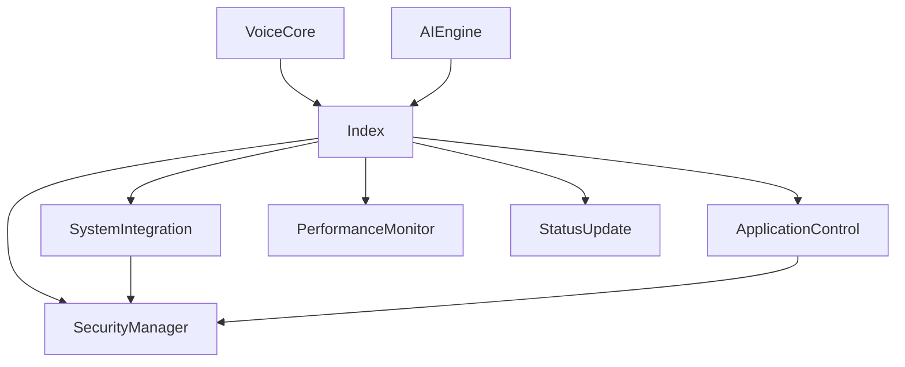

# Mac Automation Core Architecture

## Overview
The Mac Automation Core provides secure, efficient system and application control for Samantha AI on macOS. It integrates with native APIs, manages app automation, enforces security, and monitors performance, all optimized for Mac M2.

---

## Main Modules
- **systemIntegration.ts**: Native macOS API and AppleScript access
- **applicationControl.ts**: Unified app management (system, browser, Spotify, etc.)
- **securityManager.ts**: Credential storage, permission management, audit logging
- **performanceMonitor.ts**: Resource usage and system health tracking
- **index.ts**: Entry point, integration with voice core and AI engine

---

## Data & Control Flow
1. **Voice/AI Command** →
2. **index.ts**: Receives command, routes to appropriate module
3. **systemIntegration/applicationControl**: Executes system/app action
4. **securityManager**: Checks permissions, logs action
5. **performanceMonitor**: Tracks resource usage
6. **index.ts**: Returns status/result to user/voice core

---

## Security Considerations
- All sensitive actions require permission checks
- Credentials stored in macOS Keychain
- All actions logged for audit
- Execution sandboxed to prevent privilege escalation

---

## Integration Points
- **Voice Core**: Receives parsed commands for execution
- **AI Engine**: Receives structured automation requests
- **Status/Error Reporting**: Sends real-time updates to UI/voice core

---

## Diagram

---

_Last updated: 2025_
